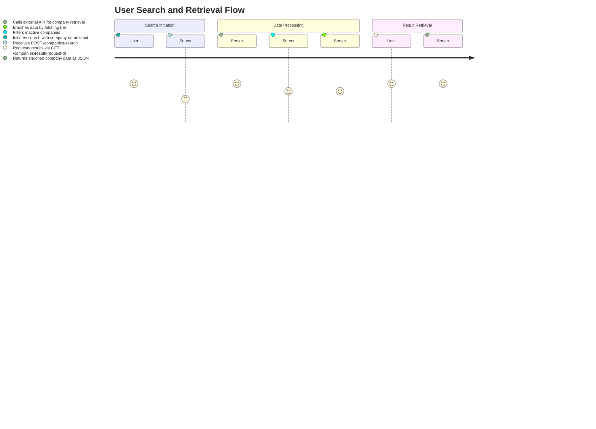
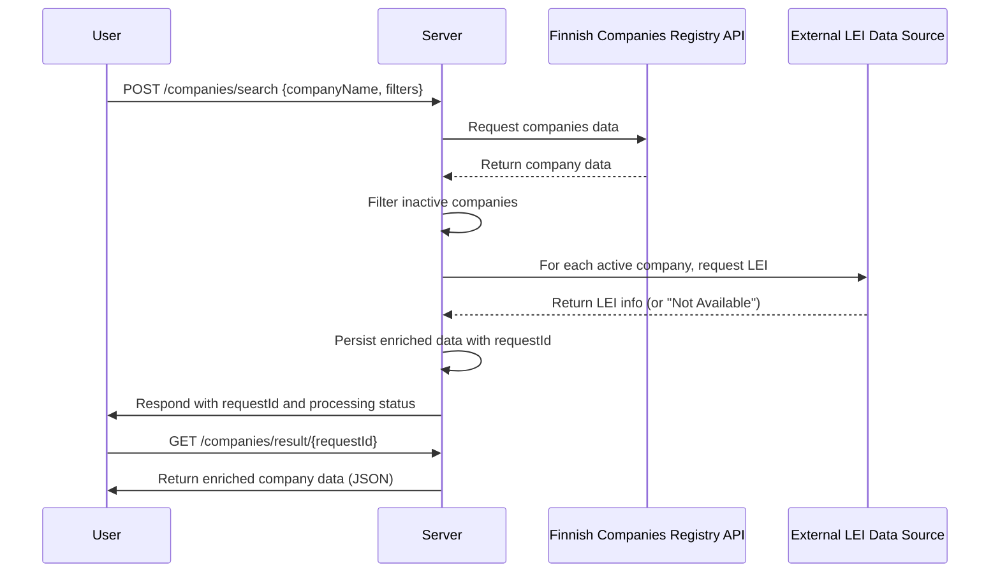

# Functional Requirements Document

## Overview
This application retrieves a subset of company data from the Finnish Companies Registry (PRH Avoindata API) based on a company name (or partial name), filters out inactive entries, enriches the data by fetching the Legal Entity Identifier (LEI) from external sources, and provides the enriched results via a separate retrieval endpoint.

## API Endpoints

### 1. POST /companies/search
- **Description:**  
  Triggers a search operation that queries the external Finnish Companies Registry and LEI data sources. All business logic, data retrieval, filtering, and enrichment occur in this endpoint.

- **Request Format:**  
  **Content-Type:** application/json  
  **Example:**
  ```json
  {
    "companyName": "Example Company",
    "filters": {
      "registrationDateStart": "2020-01-01",
      "registrationDateEnd": "2021-01-01"
    }
  }
  ```

- **Business Logic:**  
  1. Validate `companyName` and any optional filters.
  2. Invoke the Finnish Companies Registry API to retrieve company data.
  3. Filter out companies that are not active.
  4. For each active company, fetch the LEI from an external reliable financial data source.
  5. Persist the enriched data with a unique request identifier.

- **Response Format:**  
  **Content-Type:** application/json  
  **Example (immediate acknowledgment response):**
  ```json
  {
    "requestId": "12345abcde",
    "status": "processing",
    "message": "Your request is being processed. Retrieve results using GET /companies/result/{requestId}"
  }
  ```

### 2. GET /companies/result/{requestId}
- **Description:**  
  Retrieves the enriched company data corresponding to the provided request identifier.

- **Request Format:**  
  **URL Parameter:** `requestId` (string)  
  **Example:**  
  `GET /companies/result/12345abcde`

- **Response Format:**  
  **Content-Type:** application/json  
  **Example:**
  ```json
  {
    "requestId": "12345abcde",
    "results": [
      {
        "companyName": "Example Company",
        "businessId": "1234567-8",
        "companyType": "OY",
        "registrationDate": "2020-05-15",
        "status": "Active",
        "lei": "XYZ1234567890" // or "Not Available"
      }
    ]
  }
  ```

- **Notes:**  
  - The GET endpoint only retrieves internally stored results.  
  - If the results are not yet ready, a status message should be returned indicating the processing state.

## User-App Interaction Diagrams

### User Journey Diagram


### Sequence Diagram
