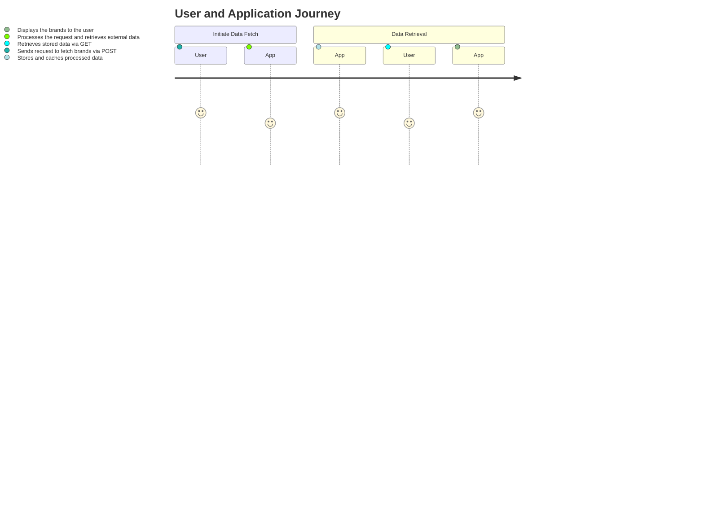
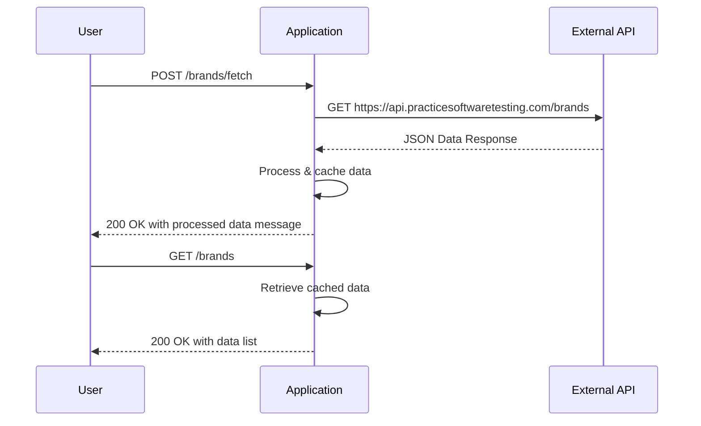

# Functional Requirements for the Project

## Overview
The application is designed to retrieve brand data from an external API and display the processed results to users. All processing logic, including external data retrieval and calculations, must be executed via POST endpoints. GET endpoints serve solely for retrieving and displaying the data stored or processed by the application.

## API Endpoints

### 1. POST /brands/fetch
- **Purpose:**  
  Invoke the external data source and perform any additional business logic.
  
- **Business Logic:**  
  - Make a GET request to "https://api.practicesoftwaretesting.com/brands".
  - Process/validate the received JSON (e.g., filtering, formatting).
  - Cache or store the processed results internally.

- **Request Format:**  
  No request body needed (or an optional body for triggering optional logic, if required).

- **Response Format:**  
  - **Success (HTTP 200):**  
    ```json
    {
      "message": "Brands fetched successfully.",
      "data": [
        {
          "id": "01JMWZK3N7PT3XMTMXMQTBACRV",
          "name": "ForgeFlex Tools",
          "slug": "forgeflex-tools"
        },
        {
          "id": "01JMWZK3N7PT3XMTMXMQTBACRW",
          "name": "MightyCraft Hardware",
          "slug": "mightycraft-hardware"
        }
      ]
    }
    ```
  - **Error:**  
    Appropriate HTTP status codes with error messages.

### 2. GET /brands
- **Purpose:**  
  Retrieve the processed/cached brand data for display in the application.

- **Request Format:**  
  No request body, possibly with query parameters for pagination or filtering.

- **Response Format:**  
  - **Success (HTTP 200):**  
    ```json
    {
      "data": [
        {
          "id": "01JMWZK3N7PT3XMTMXMQTBACRV",
          "name": "ForgeFlex Tools",
          "slug": "forgeflex-tools"
        },
        {
          "id": "01JMWZK3N7PT3XMTMXMQTBACRW",
          "name": "MightyCraft Hardware",
          "slug": "mightycraft-hardware"
        }
      ]
    }
    ```
  - **Error:**  
    Appropriate HTTP status codes with error messages.

## User-App Interaction

### Journey Diagram


### Sequence Diagram


## Best Practices
- Use proper error handling and status codes.
- Secure the endpoints as needed, especially if further business logic or sensitive data processing is involved.
- Consider caching strategies to avoid overwhelming the external API with frequent requests.