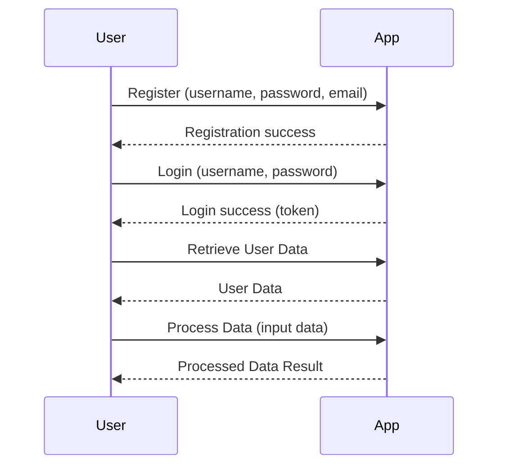

```markdown
# Functional Requirements Document

## API Endpoints

### 1. User Registration
- **Endpoint:** `POST /api/register`
- **Request Format:**
  ```json
  {
    "username": "string",
    "password": "string",
    "email": "string"
  }
  ```
- **Response Format:**
  ```json
  {
    "message": "User registered successfully",
    "userId": "string"
  }
  ```

### 2. User Login
- **Endpoint:** `POST /api/login`
- **Request Format:**
  ```json
  {
    "username": "string",
    "password": "string"
  }
  ```
- **Response Format:**
  ```json
  {
    "message": "Login successful",
    "token": "string"
  }
  ```

### 3. Retrieve User Data
- **Endpoint:** `GET /api/user`
- **Request Format:** 
  - Headers: 
    ```json
    {
      "Authorization": "Bearer token"
    }
    ```
- **Response Format:**
  ```json
  {
    "userId": "string",
    "username": "string",
    "email": "string"
  }
  ```

### 4. Data Processing
- **Endpoint:** `POST /api/process-data`
- **Request Format:**
  ```json
  {
    "inputData": "string"
  }
  ```
- **Response Format:**
  ```json
  {
    "result": "string"
  }
  ```

## User-App Interaction Diagram


```