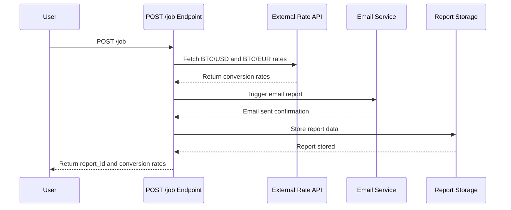
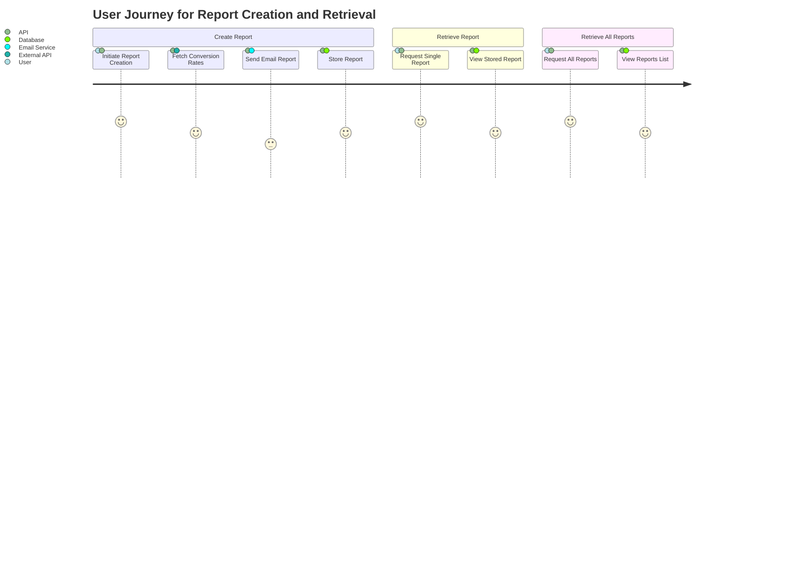

# Functional Requirements Document

## Overview

The application retrieves the current Bitcoin-to-USD and Bitcoin-to-EUR conversion rates, sends these rates via an email report, and stores the report for later retrieval. All external data calls and business logic are implemented within the POST endpoint.

## API Endpoints

### 1. POST /job

- **Description:** 
  Initiates the report creation process. This endpoint:
  - Fetches the latest BTC/USD and BTC/EUR conversion rates from an external API.
  - Performs any necessary calculations.
  - Triggers an email with the conversion rates report.
  - Stores the generated report in the system.
  
- **Request Format:**  
  No body parameters are required.

- **Response Format:**  
  **Success:**  
  ```json
  {
    "report_id": "unique-report-id",
    "status": "Report created and email sent",
    "timestamp": "ISO8601 formatted timestamp",
    "conversion_rates": {
      "BTC_USD": "rate",
      "BTC_EUR": "rate"
    }
  }
  ```  
  **On failure (e.g., external API error):**  
  ```json
  {
    "error": "Description of the error"
  }
  ```

### 2. GET /report/{id}

- **Description:** 
  Retrieves a stored report by its unique report ID.

- **Request Format:**  
  Path parameter: `report_id`.

- **Response Format:**  
  **Success:**  
  ```json
  {
    "report_id": "unique-report-id",
    "timestamp": "ISO8601 formatted timestamp",
    "conversion_rates": {
      "BTC_USD": "rate",
      "BTC_EUR": "rate"
    },
    "email_status": "Email send confirmation/status"
  }
  ```  
  **Not Found or error:**  
  ```json
  {
    "error": "Report not found"
  }
  ```

### 3. GET /reports

- **Description:** 
  Retrieves a list of all stored reports.

- **Request Format:**  
  No body parameters are required.

- **Response Format:**  
  **Success:**  
  ```json
  [
    {
      "report_id": "unique-report-id",
      "timestamp": "ISO8601 formatted timestamp",
      "conversion_rates": {
        "BTC_USD": "rate",
        "BTC_EUR": "rate"
      },
      "email_status": "Email send confirmation/status"
    },
    { ... }
  ]
  ```  
  **On error:**  
  ```json
  {
    "error": "Description of the error"
  }
  ```

## Business Logic Notes

- All external API calls (to fetch BTC rates) are executed within the POST /job endpoint.
- GET endpoints strictly return stored data without making any new external requests.
- The system must handle errors gracefully, such that if the external API call fails, an appropriate error message is returned and logged.

## Mermaid Diagrams

### Sequence Diagram for POST /job



### Journey Diagram

