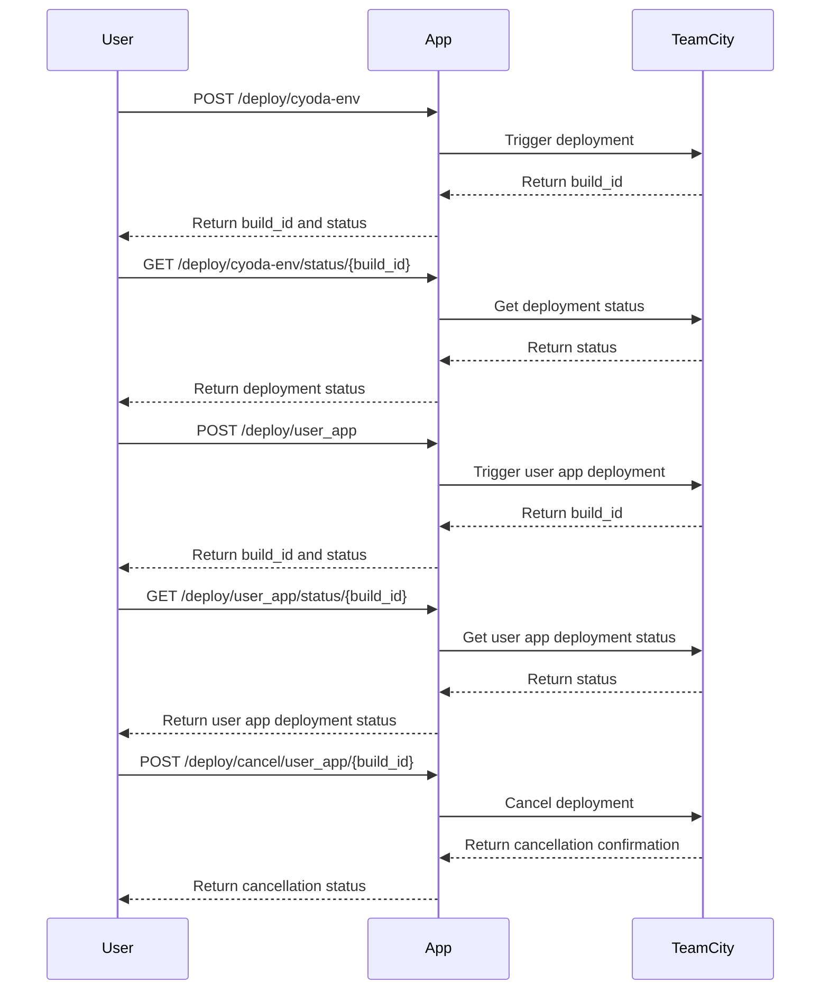

```markdown
# Functional Requirements Document

## API Endpoints

### 1. Deploy Cyoda Environment
- **Endpoint**: `POST /deploy/cyoda-env`
- **Request Format**:
  ```json
  {
      "user_name": "test"
  }
  ```
- **Response Format**:
  ```json
  {
      "build_id": "12345",
      "status": "queued"
  }
  ```

### 2. Deploy User Application
- **Endpoint**: `POST /deploy/user_app`
- **Request Format**:
  ```json
  {
      "repository_url": "http://....",
      "is_public": true,
      "user_name": "test"
  }
  ```
- **Response Format**:
  ```json
  {
      "build_id": "67890",
      "status": "queued"
  }
  ```

### 3. Get Cyoda Environment Deployment Status
- **Endpoint**: `GET /deploy/cyoda-env/status/{build_id}`
- **Response Format**:
  ```json
  {
      "build_id": "12345",
      "status": "running",
      "details": "Deployment in progress..."
  }
  ```

### 4. Get Cyoda Environment Deployment Statistics
- **Endpoint**: `GET /deploy/cyoda-env/statistics/{build_id}`
- **Response Format**:
  ```json
  {
      "build_id": "12345",
      "statistics": {
          "duration": "5m",
          "success": true,
          "logs": "..."
      }
  }
  ```

### 5. Get User Application Deployment Status
- **Endpoint**: `GET /deploy/user_app/status/{build_id}`
- **Response Format**:
  ```json
  {
      "build_id": "67890",
      "status": "running",
      "details": "Deployment in progress..."
  }
  ```

### 6. Get User Application Deployment Statistics
- **Endpoint**: `GET /deploy/user_app/statistics/{build_id}`
- **Response Format**:
  ```json
  {
      "build_id": "67890",
      "statistics": {
          "duration": "10m",
          "success": false,
          "logs": "..."
      }
  }
  ```

### 7. Cancel User Application Deployment
- **Endpoint**: `POST /deploy/cancel/user_app/{build_id}`
- **Request Format**:
  ```json
  {
      "comment": "Canceling a queued build",
      "readdIntoQueue": false
  }
  ```
- **Response Format**:
  ```json
  {
      "build_id": "67890",
      "status": "canceled"
  }
  ```

## User-App Interaction Visualization


```