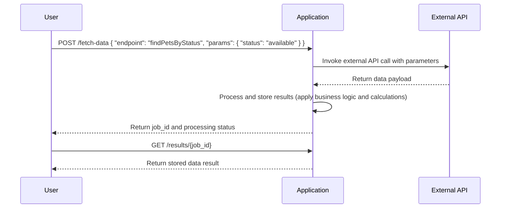
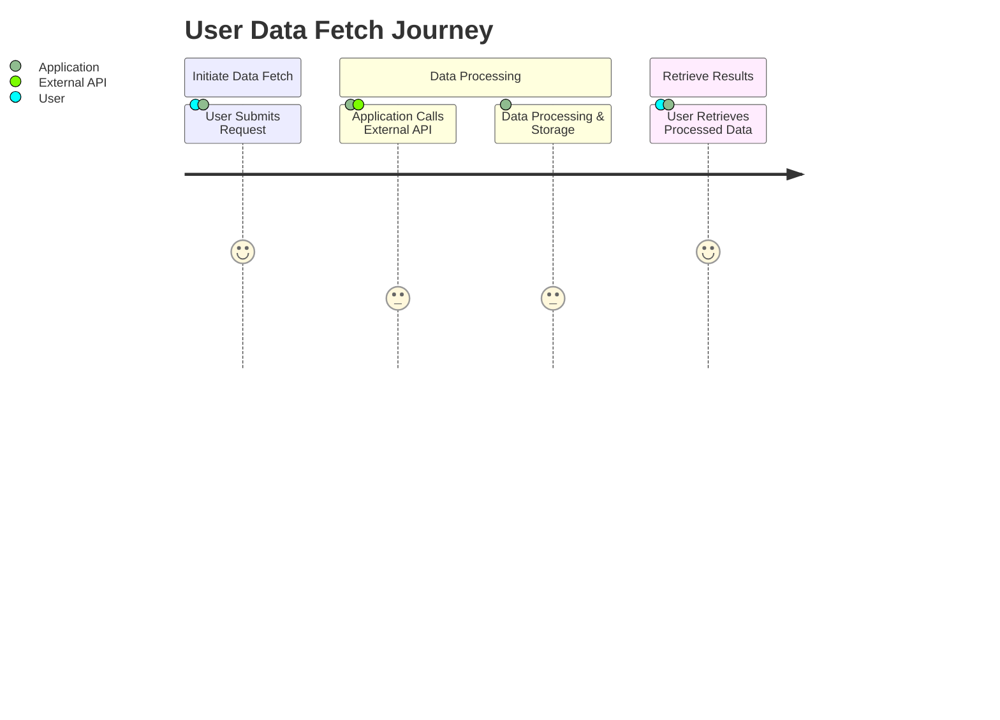

Answer: 

# Functional Requirements Document

## Overview
This document outlines the functional requirements for a backend application designed to fetch data from an external API (the Pet Store API) and serve the results via RESTful endpoints. The architecture adheres to specific guidelines where data retrieval and business logic processing must occur within POST endpoints.

## API Endpoints

### 1. POST /fetch-data
- **Purpose:** Initiate a request to fetch data from the external Pet Store API.
- **Request Format:** 
  - Content-Type: application/json
  - **Example Request Body:**
    ```json
    {
      "endpoint": "findPetsByStatus",
      "params": {
        "status": "available"
      }
    }
    ```
  - **Fields:**
    - `endpoint`: Specifies the external API endpoint to invoke (e.g., "findPetsByStatus", "getPetById").
    - `params`: A JSON object with parameters required for the external API call.

- **Response Format:** 
  - Content-Type: application/json
  - **Example Response:**
    ```json
    {
      "job_id": "abc123",
      "status": "Processing",
      "message": "Your request is being processed"
    }
    ```
  - **Fields:**
    - `job_id`: Unique identifier for the fetch job.
    - `status`: Current state of the job (e.g., "Processing", "Completed").
    - `message`: Additional information if needed.

### 2. GET /results/{job_id}
- **Purpose:** Retrieve the results associated with a previously initiated fetch job.
- **Request Format:** 
  - Path Parameter: `job_id` (string)

- **Response Format:** 
  - Content-Type: application/json
  - **Example Response:**
    ```json
    {
      "job_id": "abc123",
      "data": [...],
      "status": "Completed"
    }
    ```
  - **Fields:**
    - `data`: The result set fetched and processed from the external API.
    - `status`: Indicates if the processing is complete.

## Additional Considerations
- **Error Handling:** 
  - For invalid requests or errors during processing, the endpoints should return HTTP 400/500 errors with a JSON body containing an error message.
  
- **Data Storage:** 
  - After processing in the POST endpoint, results are stored transiently to allow retrieval later via the GET endpoint.

## User-App Interaction Diagrams

### Sequence Diagram


### Journey Diagram


Answer: The functional requirements have been formatted and presented as requested, including API endpoints, request/response formats, and user-app interaction diagrams.