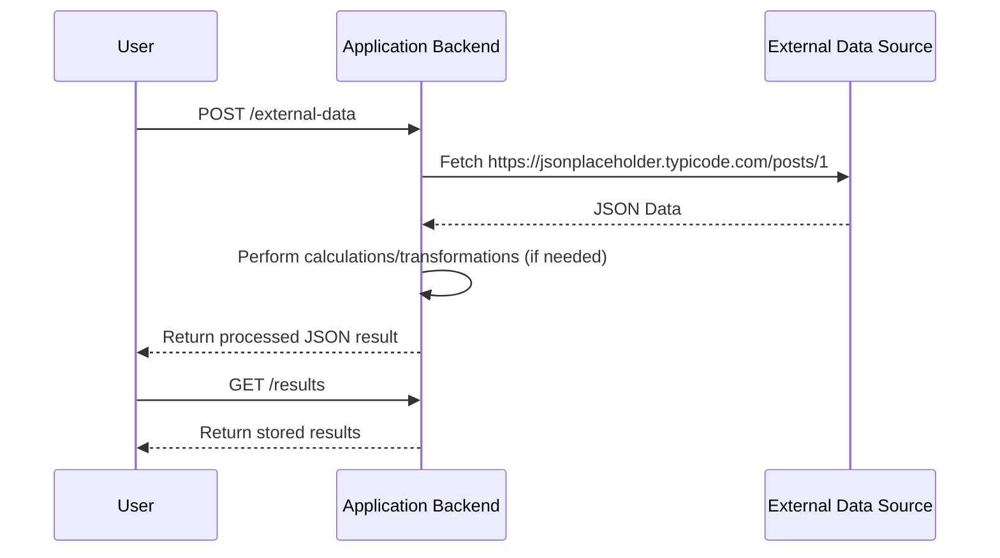
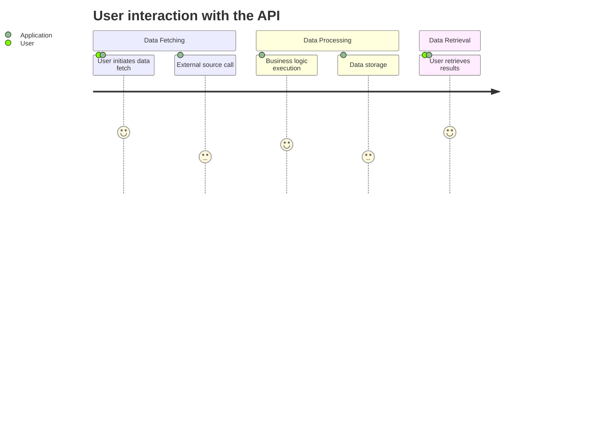

Answer:
```markdown
# Functional Requirements Document

## Overview
This project exposes a RESTful API that integrates data from an external source (https://jsonplaceholder.typicode.com/posts/1) into the system. External data retrieval and any associated business logic or calculations are executed as part of a POST endpoint, while GET endpoints are reserved for retrieving stored data/results.

## API Endpoints

### 1. POST /external-data
- **Purpose:** Invoke business logic to fetch data from the external JSON data source and perform any necessary calculations or transformations.
- **Request Format:**  
  - **Headers:** Content-Type: application/json  
  - **Body (optional parameters):**
    ```json
    {
      "param": "value"  // Optional parameters for transformation or calculation, if needed.
    }
    ```
- **Response Format:**  
  - **Status:** 200 OK (or appropriate error status if the external call fails)
    ```json
    {
      "userId": 1,
      "id": 1,
      "title": "sunt aut facere repellat provident occaecati excepturi optio reprehenderit",
      "body": "quia et suscipit\nsuscipit recusandae consequuntur expedita et cum\nreprehenderit molestiae ut ut quas totam\nnostrum rerum est autem sunt rem eveniet architecto",
      "calculationResult": "result" // Optional field after performing calculations, if applicable.
    }
    ```

### 2. GET /results
- **Purpose:** Retrieve previously stored or computed results after processing the external data.
- **Request Format:**  
  - **Headers:** Content-Type: application/json  
  - **Body:** (No body required)
- **Response Format:**  
  - **Status:** 200 OK (or appropriate error status)
    ```json
    {
      "results": [
        {
          "userId": 1,
          "id": 1,
          "title": "sunt aut facere repellat provident occaecati excepturi optio reprehenderit",
          "body": "quia et suscipit...",
          "calculationResult": "result" // If any computation has been applied.
        }
      ]
    }
    ```

## Business Logic
- All interactions with external data sources and any calculations must be encapsulated within the POST endpoint (/external-data).
- The POST endpoint is responsible for:
  - Initiating the connection to the external data source.
  - Fetching and validating the JSON structure.
  - Optionally applying any business-specific calculations or transformations.
  - Storing the resulting data for later retrieval.
- The GET endpoint (/results) only retrieves and returns data already stored or computed by prior POST requests.

## User-App Interaction Diagrams

### Sequence Diagram


### Journey Diagram


Answer: The final functional requirements have been formatted and presented in the markdown document above.