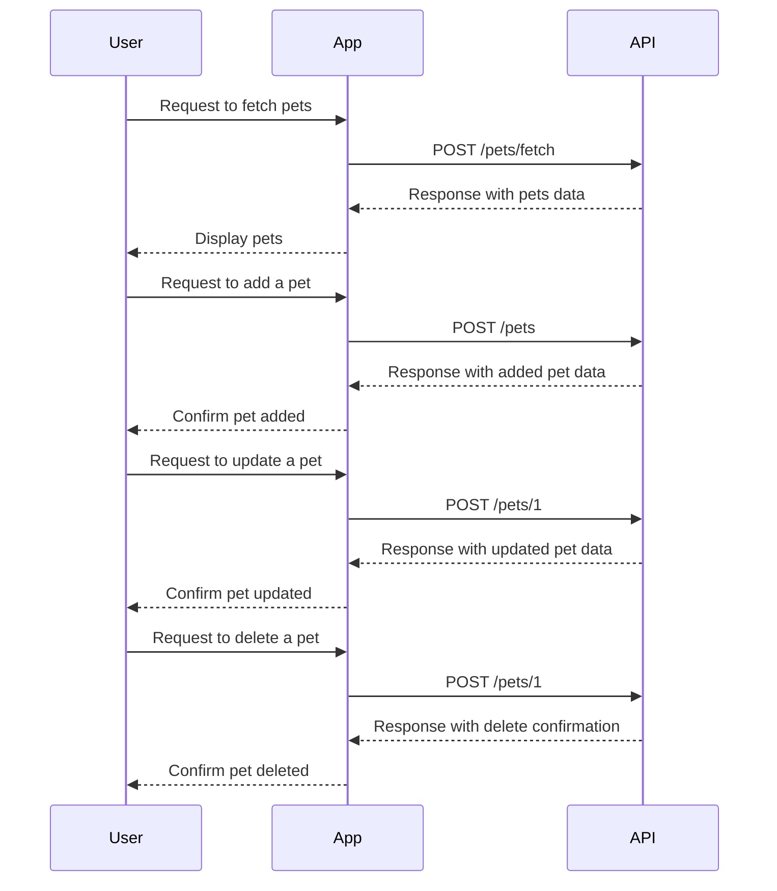

```markdown
# Functional Requirements Document

## API Endpoints

### 1. Fetch Pets
- **Endpoint**: `/pets/fetch`
- **Method**: `POST`
- **Description**: Retrieves a list of pets based on their status.
- **Request Format**:
  ```json
  {
    "status": ["available", "pending", "sold"]
  }
  ```
- **Response Format**:
  ```json
  {
    "pets": [
      {
        "id": 1,
        "name": "doggie",
        "status": "available"
      },
      ...
    ]
  }
  ```

### 2. Add a Pet
- **Endpoint**: `/pets`
- **Method**: `POST`
- **Description**: Adds a new pet to the store.
- **Request Format**:
  ```json
  {
    "name": "doggie",
    "category": {
      "id": 1,
      "name": "Dogs"
    },
    "photoUrls": ["url1", "url2"],
    "tags": [
      {
        "id": 1,
        "name": "tag1"
      }
    ],
    "status": "available"
  }
  ```
- **Response Format**:
  ```json
  {
    "id": 1,
    "name": "doggie",
    "status": "available"
  }
  ```

### 3. Update a Pet
- **Endpoint**: `/pets/{petId}`
- **Method**: `POST`
- **Description**: Updates an existing pet's details.
- **Request Format**:
  ```json
  {
    "id": 1,
    "name": "doggie updated",
    "status": "sold"
  }
  ```
- **Response Format**:
  ```json
  {
    "id": 1,
    "name": "doggie updated",
    "status": "sold"
  }
  ```

### 4. Delete a Pet
- **Endpoint**: `/pets/{petId}`
- **Method**: `POST`
- **Description**: Deletes a pet from the store.
- **Request Format**:
  ```json
  {
    "petId": 1
  }
  ```
- **Response Format**:
  ```json
  {
    "message": "Pet deleted successfully"
  }
  ```

### 5. User Login
- **Endpoint**: `/user/login`
- **Method**: `POST`
- **Description**: Authenticates a user and returns a token.
- **Request Format**:
  ```json
  {
    "username": "user1",
    "password": "password"
  }
  ```
- **Response Format**:
  ```json
  {
    "token": "your_auth_token"
  }
  ```

## User-App Interaction


```