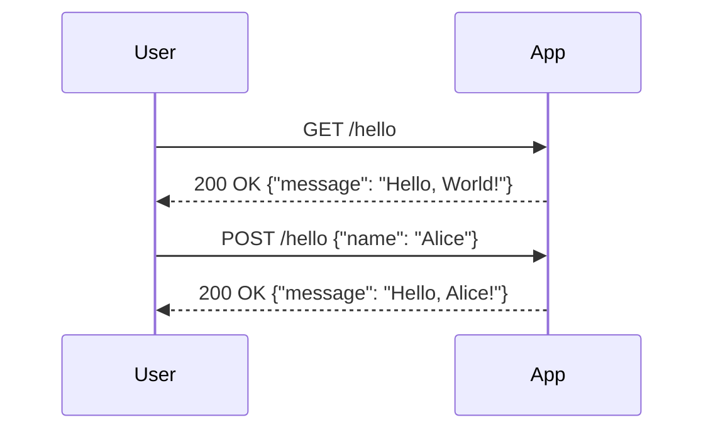

```markdown
# Functional Requirements for Hello World App

## API Endpoints

### 1. GET /hello
- **Description**: Retrieve the "Hello World" message.
- **Request Format**: 
  - Method: GET
- **Response Format**: 
  - Status Code: 200 OK
  - Body: 
    ```json
    {
      "message": "Hello, World!"
    }
    ```

### 2. POST /hello
- **Description**: Accept a name and return a personalized greeting.
- **Request Format**: 
  - Method: POST
  - Headers: 
    - Content-Type: application/json
  - Body: 
    ```json
    {
      "name": "string"
    }
    ```
- **Response Format**: 
  - Status Code: 200 OK
  - Body: 
    ```json
    {
      "message": "Hello, {name}!"
    }
    ```

## User-App Interaction Diagram



## Summary
- The application consists of two endpoints: one for retrieving a static message and another for generating a personalized greeting based on user input.
- Responses are formatted in JSON, adhering to RESTful principles.
```