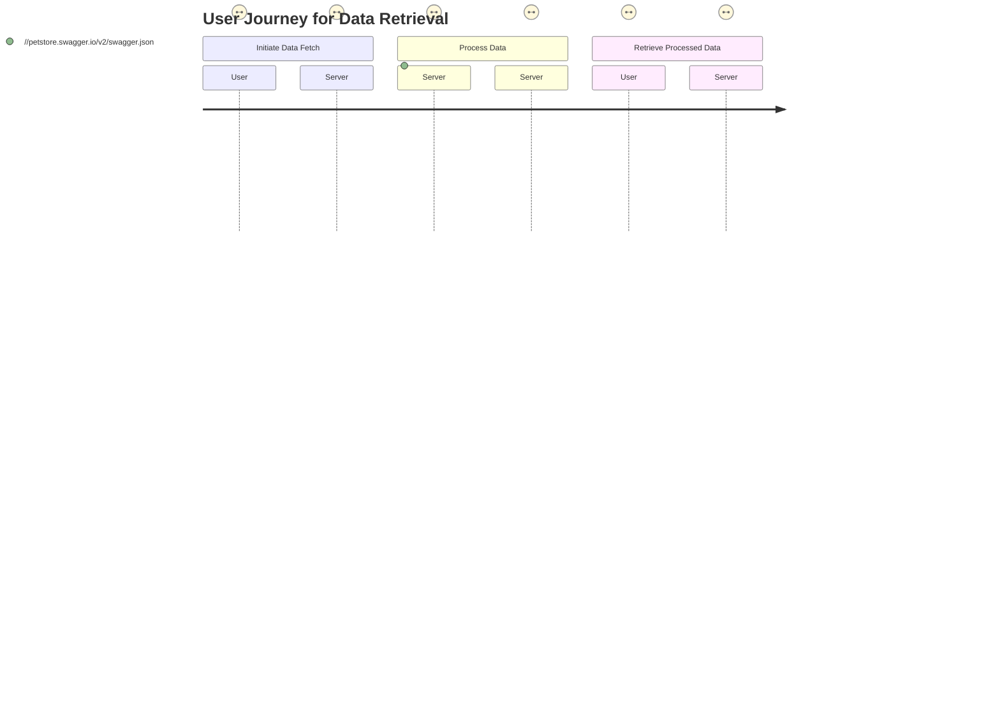
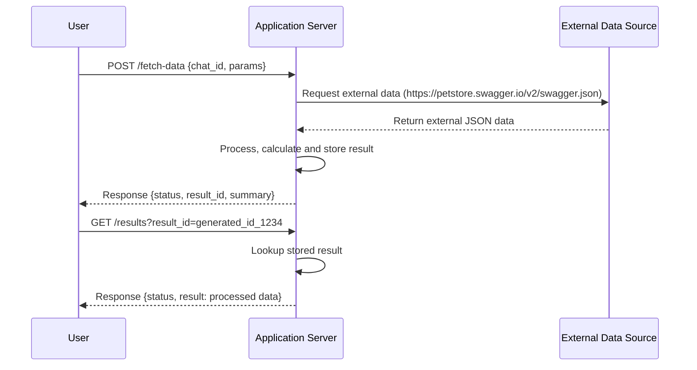

# Functional Requirements

## Overview
The project involves developing a backend application using Python Quart that interacts with an external data source, specifically the Petstore API. The application will have defined API endpoints for fetching and retrieving data, adhering to RESTful principles.

## API Endpoints

### 1. POST /fetch-data
- **Purpose**: To invoke business logic that fetches and processes data from the external data source.
- **Request Format** (JSON):
  ```json
  {
    "chat_id": "ae32cb29-fe9f-11ef-975f-40c2ba0ac9eb",
    "additional_params": { /* optional parameters for filtering or calculations */ }
  }
  ```
- **Business Logic**:
  - Connect to the external data source (Petstore API).
  - Retrieve the JSON data.
  - Process and filter the data as per business requirements.
  - Store the processed result within the application.
- **Response Format** (JSON):
  - **Success Example**:
    ```json
    {
      "status": "success",
      "result_id": "generated_id_1234",
      "details": { /* summary of processed data */ }
    }
    ```
  - **Error Example**:
    ```json
    {
      "status": "error",
      "message": "Detailed error message here"
    }
    ```

### 2. GET /results
- **Purpose**: To retrieve results previously processed and stored by the application.
- **Request Format**:
  - Query parameters can be used:
    ```
    /results?result_id=generated_id_1234
    ```
- **Response Format** (JSON):
  - **Success Example**:
    ```json
    {
      "status": "success",
      "result": { /* full details of the processed external data */ }
    }
    ```
  - **Error Example**:
    ```json
    {
      "status": "error",
      "message": "Result not found or applicable error message."
    }
    ```

## User-App Interaction

### User Journey Diagram



### Sequence Diagram

