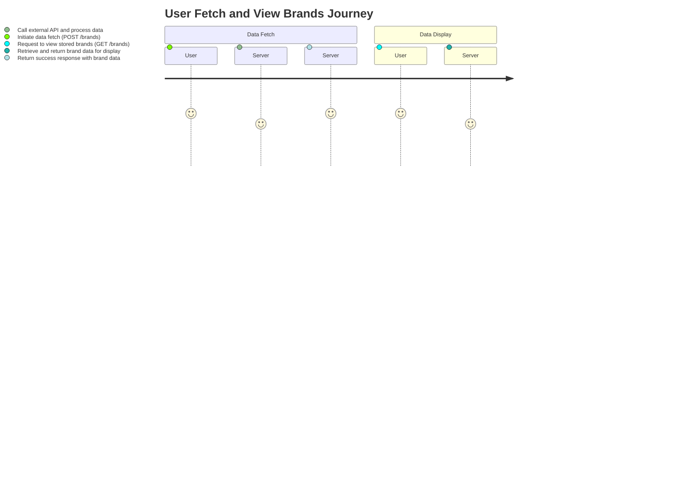
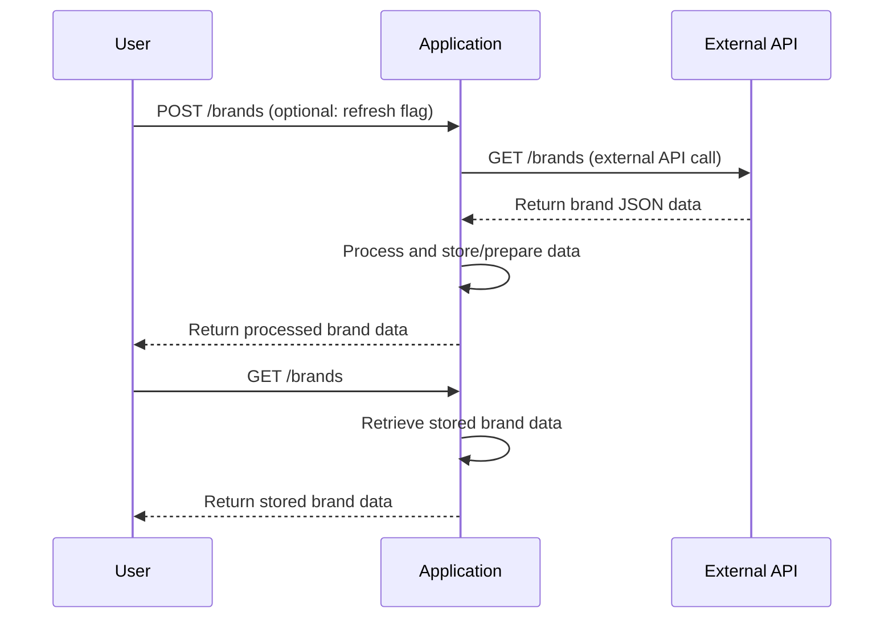

# Functional Requirements Specification

## 1. Endpoints

### 1.1 POST /brands
- **Purpose:**  
  Invoke business logic to retrieve brand data from an external API and perform any necessary calculations or processing.

- **Request:**  
  - **Headers:**  
    - `Content-Type: application/json`  
  - **Body Parameters (optional):**  
    - `refresh` (boolean): Indicates if data should be re-fetched from the external source even if cached.
  
- **Response:**  
  - **Status 200:**  
    ```json
    {
      "success": true,
      "data": [
        {
          "id": "01JMWZK3N7PT3XMTMXMQTBACRV",
          "name": "ForgeFlex Tools",
          "slug": "forgeflex-tools"
        },
        {
          "id": "01JMWZK3N7PT3XMTMXMQTBACRW",
          "name": "MightyCraft Hardware",
          "slug": "mightycraft-hardware"
        }
      ],
      "message": "Brands fetched successfully."
    }
    ```
  - **Error Response:**  
    ```json
    {
      "success": false,
      "error": "Description of the error."
    }
    ```

### 1.2 GET /brands
- **Purpose:**  
  Retrieve the processed or stored brand data from the application for display.

- **Request:**  
  - No request body is required.
  - Optional query parameters may be defined for filtering purposes (e.g., filter by name or slug).

- **Response:**  
  - **Status 200:**  
    ```json
    [
      {
        "id": "01JMWZK3N7PT3XMTMXMQTBACRV",
        "name": "ForgeFlex Tools",
        "slug": "forgeflex-tools"
      },
      {
        "id": "01JMWZK3N7PT3XMTMXMQTBACRW",
        "name": "MightyCraft Hardware",
        "slug": "mightycraft-hardware"
      }
    ]
    ```
  - **Error Response:**  
    ```json
    {
      "success": false,
      "error": "Description of the error."
    }
    ```

## 2. Additional Functional Considerations
- All external API calls and computations are encapsulated within the POST endpoint. This ensures that GET requests are only used for retrieving already processed or stored results.
- Data validation and error handling will be implemented to manage network issues and unexpected API responses.
- The application may cache the retrieved data or store it in a persistent layer for subsequent GET requests.

## 3. User-App Interaction Diagrams

### 3.1 Journey Diagram


### 3.2 Sequence Diagram
