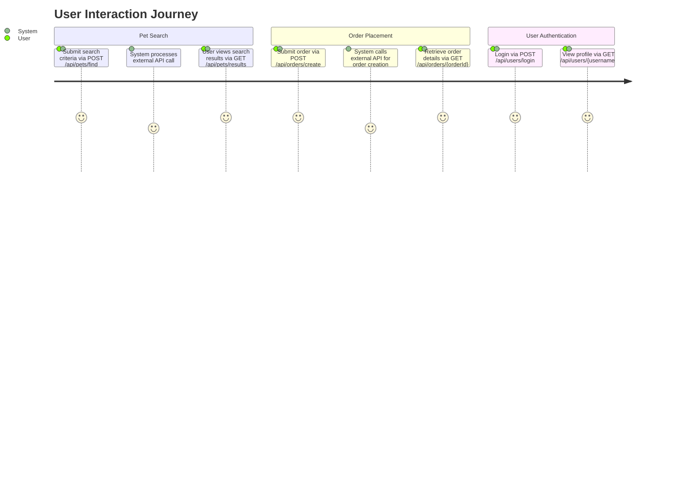
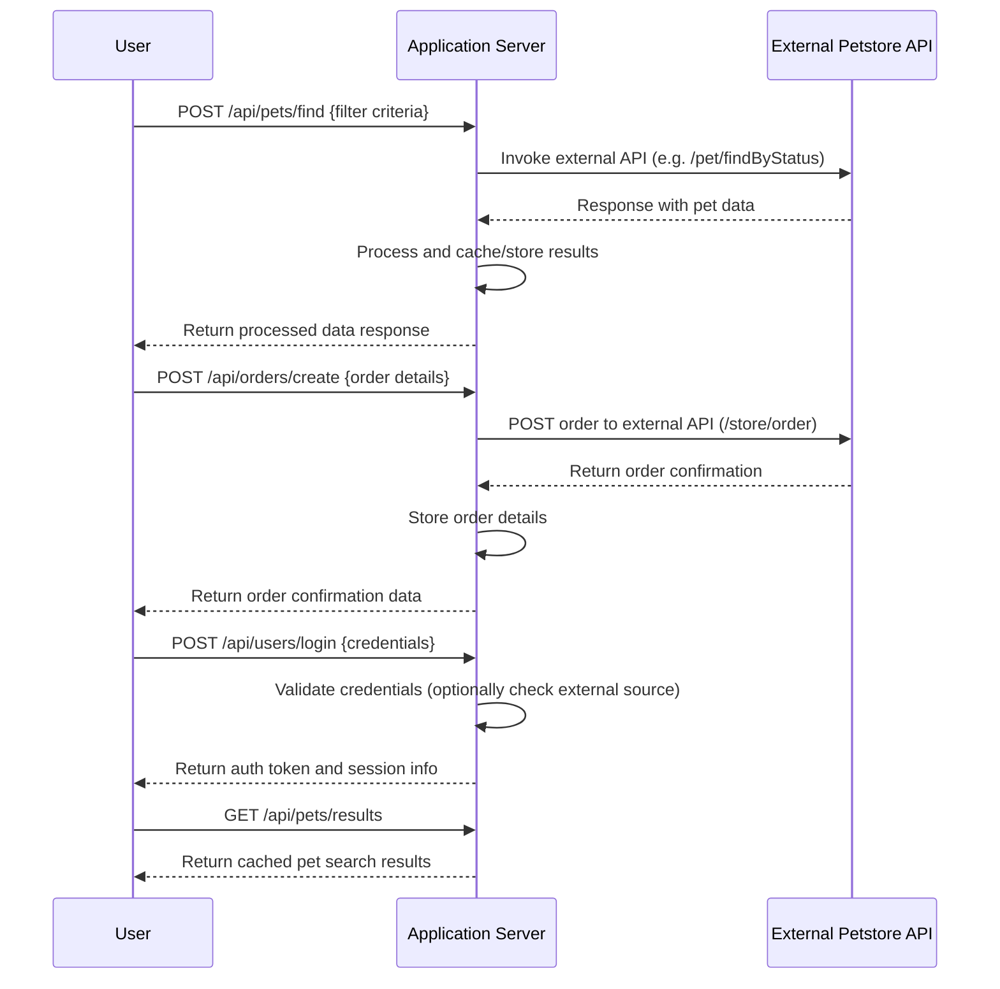

# Functional Requirements Specification for Petstore Integration App

## API Endpoints

All business logic involving external data retrieval, calculations, or invocation of third-party APIs must be performed via POST endpoints. GET endpoints are to be used solely for retrieving application results stored or cached in the system.

### 1. Pet Endpoints

- **POST /api/pets/find**  
  **Description**: Retrieve pets from the external Petstore API based on provided filter criteria (e.g., status, tags).  
  **Request (JSON)**:
  ```json
  {
    "status": "available",          // string or array of strings
    "tags": ["friendly", "cute"]    // optional array of strings
  }
  ```  
  **Response (JSON)**:
  ```json
  {
    "results": [ { Pet Object }, { Pet Object }, ... ]
  }
  ```  
  **Business Logic**: The endpoint invokes the external Petstore API (e.g. /pet/findByStatus or /pet/findByTags) and processes the response.

- **GET /api/pets/results**  
  **Description**: Retrieve the internally stored or cached pet search results.  
  **Response (JSON)**:
  ```json
  {
    "results": [ { Pet Object }, { Pet Object }, ... ]
  }
  ```

### 2. Order Endpoints

- **POST /api/orders/create**  
  **Description**: Place an order by relaying the order data to the external Petstore API.  
  **Request (JSON)**:
  ```json
  {
    "petId": 123,
    "quantity": 2,
    "shipDate": "2023-10-20T15:30:00Z",
    "status": "placed",
    "complete": true
  }
  ```  
  **Response (JSON)**:
  ```json
  {
    "order": { Order Object }
  }
  ```  
  **Business Logic**: Processes order placement via the external API /store/order and captures the result.

- **GET /api/orders/{orderId}**  
  **Description**: Retrieve order details stored within the application.  
  **Response (JSON)**:
  ```json
  {
    "order": { Order Object }
  }
  ```

### 3. User Endpoints

- **POST /api/users/login**  
  **Description**: Log in a user by validating credentials via external/user business logic.  
  **Request (JSON)**:
  ```json
  {
    "username": "user1",
    "password": "secret"
  }
  ```  
  **Response (JSON)**:
  ```json
  {
    "token": "JWT or Session Token",
    "expires": "2023-10-31T23:59:59Z"
  }
  ```  
  **Business Logic**: The login process would authenticate the user, invoke external validation if needed, and save session details internally.

- **GET /api/users/{username}**  
  **Description**: Retrieve user details stored within the application.  
  **Response (JSON)**:
  ```json
  {
    "user": { User Object }
  }
  ```

## Request/Response Standards

- All requests and responses use JSON with standard HTTP status codes.
- POST endpoints perform all external API calls and process returned data before caching/storing it.
- GET endpoints simply retrieve data already processed by the system.

## User Journey Diagram



## API Sequence Diagram

