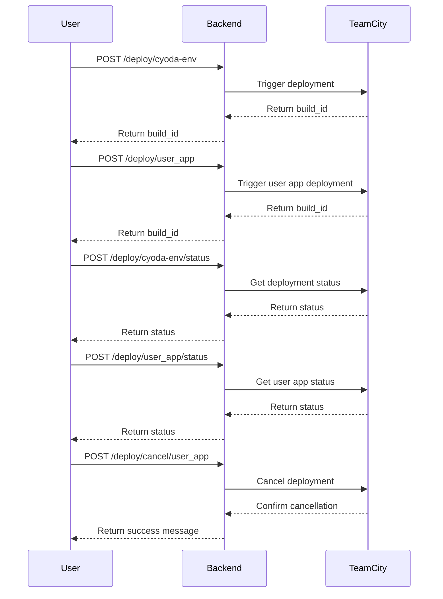

```markdown
# Functional Requirements Document

## API Endpoints

### 1. Deploy Cyoda Environment
- **Endpoint**: `/deploy/cyoda-env`
- **Method**: POST
- **Request Format**:
    ```json
    {}
    ```
- **Response Format**:
    ```json
    {
        "build_id": "string"
    }
    ```

### 2. Deploy User Application
- **Endpoint**: `/deploy/user_app`
- **Method**: POST
- **Request Format**:
    ```json
    {
        "repository_url": "string",
        "is_public": "string"
    }
    ```
- **Response Format**:
    ```json
    {
        "build_id": "string"
    }
    ```

### 3. Get Cyoda Environment Status
- **Endpoint**: `/deploy/cyoda-env/status`
- **Method**: POST
- **Request Format**:
    ```json
    {
        "build_id": "string"
    }
    ```
- **Response Format**:
    ```json
    {
        "state": "string",
        "statistics": {},
        "status": "string",
        "statusText": "string"
    }
    ```

### 4. Get User Application Status
- **Endpoint**: `/deploy/user_app/status`
- **Method**: POST
- **Request Format**:
    ```json
    {
        "build_id": "string"
    }
    ```
- **Response Format**:
    ```json
    {
        "state": "string",
        "statistics": {},
        "status": "string",
        "statusText": "string"
    }
    ```

### 5. Get Cyoda Environment Statistics
- **Endpoint**: `/deploy/cyoda-env/statistics`
- **Method**: POST
- **Request Format**:
    ```json
    {
        "build_id": "string"
    }
    ```
- **Response Format**:
    ```json
    {}
    ```

### 6. Get User Application Statistics
- **Endpoint**: `/deploy/user_app/statistics`
- **Method**: POST
- **Request Format**:
    ```json
    {
        "build_id": "string"
    }
    ```
- **Response Format**:
    ```json
    {}
    ```

### 7. Cancel User Application Deployment
- **Endpoint**: `/deploy/cancel/user_app`
- **Method**: POST
- **Request Format**:
    ```json
    {
        "build_id": "string",
        "comment": "string",
        "readdIntoQueue": true
    }
    ```
- **Response Format**:
    ```json
    {
        "message": "Deployment canceled successfully."
    }
    ```

## User-App Interaction Diagram


```