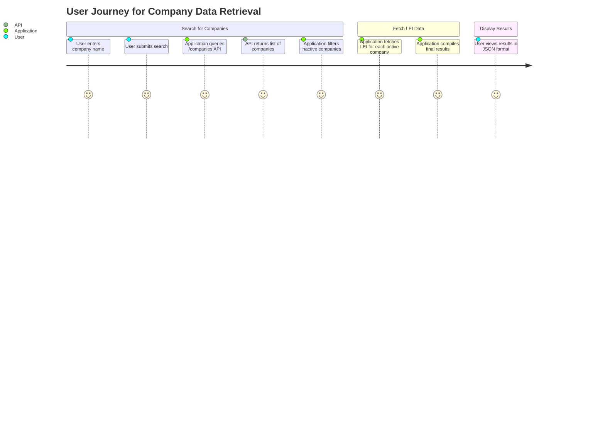
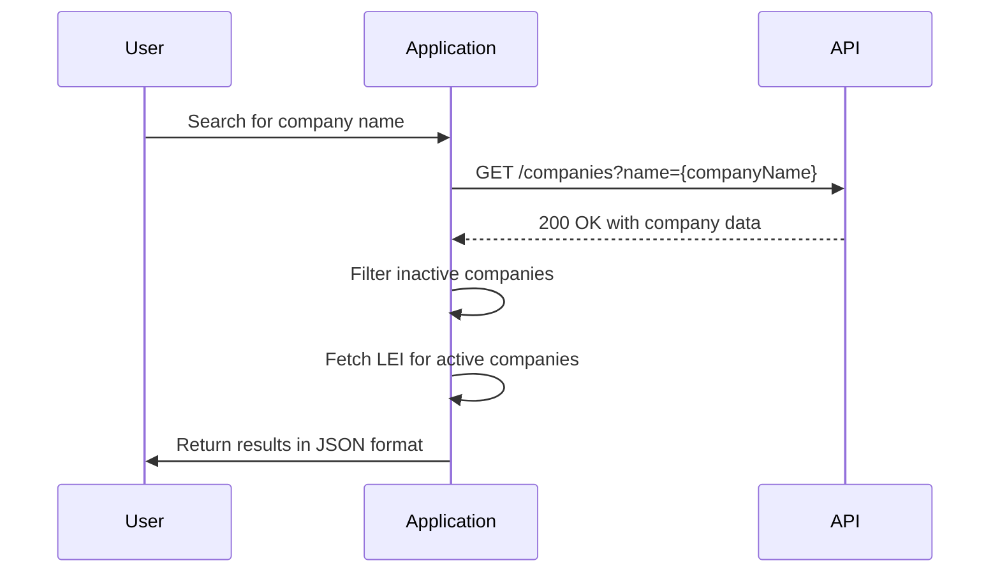

Here are the final functional requirements for the Finnish Companies Data Retrieval and Enrichment Application, formatted for clarity and completeness:

### Functional Requirements Document

#### 1. Overview
This application retrieves data from the Finnish Companies Registry based on a company name, filters out inactive companies, and enriches the data by fetching the Legal Entity Identifier (LEI).

#### 2. User Stories
1. **Data Retrieval**:
   - As a user, I want to search for companies by name so that I can retrieve their details from the Finnish Companies Registry.
   - As a user, I want to see only active companies in the search results to ensure the information is relevant.

2. **LEI Data Enrichment**:
   - As a user, I want the application to automatically fetch the Legal Entity Identifier (LEI) for active companies so that I have complete information.

3. **Output Format**:
   - As a user, I want the results to be returned in JSON format so that I can easily parse and use the data.

#### 3. API Endpoints
1. **GET /companies**
   - **Description**: Retrieve a list of companies based on a query.
   - **Request**:
     - **Query Parameters**:
       - `name` (string, required): Company name or partial name to search.
       - `location` (string, optional): Town or city where the company is registered.
       - `businessId` (string, optional): Unique Business ID.
       - `companyForm` (string, optional): Form of the company.
       - `mainBusinessLine` (string, optional): Main line of business.
       - `registrationDateStart` (date, optional): Start date for registration.
       - `registrationDateEnd` (date, optional): End date for registration.
       - `page` (integer, optional): Pagination for results.
   - **Response**:
     - **200 OK**:
       ```json
       [
         {
           "companyName": "Example Company",
           "businessId": "1234567-8",
           "companyType": "OY",
           "registrationDate": "2020-01-01",
           "status": "Active",
           "lei": "LEI123456789"
         }
       ]
       ```
     - **400 Bad Request**:
       ```json
       {
         "error": "Invalid request parameters"
       }
       ```
     - **500 Internal Server Error**:
       ```json
       {
         "error": "An unexpected error occurred"
       }
       ```

#### 4. Visual Representation
- **User Journey**:


- **Sequence of API Interaction**:


This structured document provides a comprehensive overview of the functional requirements for your application. If you have any further adjustments or additions, please let me know!