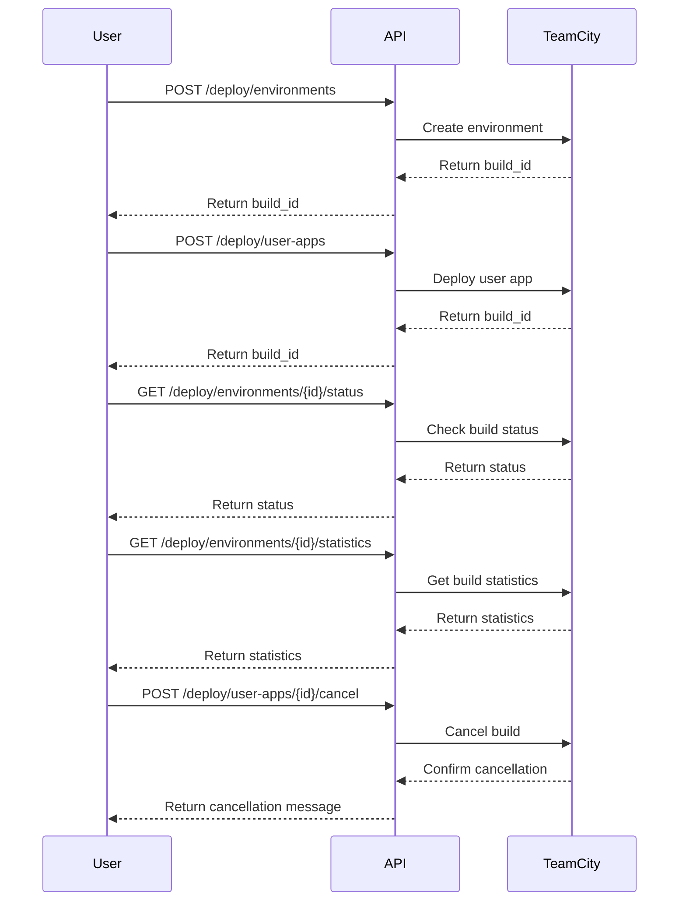

Here’s a well-formatted summary of the final functional requirements for your application, including user stories, API endpoints, request/response formats, and visual representation.

---

## Functional Requirements for Deployment Management Application

### User Stories

1. **User Authentication**
   - **As a user**, I want to authenticate using a Bearer token so that I can securely access the deployment features.

2. **Create Environment Configuration**
   - **As a user**, I want to create a new environment configuration by providing my username so that I can manage my deployments.
     - **API Endpoint**: `POST /deploy/environments`
       - **Request**:
         ```json
         {
             "user_name": "test"
         }
         ```
       - **Response**:
         ```json
         {
             "build_id": "12345"
         }
         ```

3. **Deploy User Application**
   - **As a user**, I want to deploy my application by providing a repository URL and visibility settings so that I can manage my application deployments.
     - **API Endpoint**: `POST /deploy/user-apps`
       - **Request**:
         ```json
         {
             "repository_url": "http://....",
             "is_public": true
         }
         ```
       - **Response**:
         ```json
         {
             "build_id": "67890"
         }
         ```

4. **Check Deployment Status**
   - **As a user**, I want to check the status of my environment configuration deployment using the build ID.
     - **API Endpoint**: `GET /deploy/environments/{id}/status`
       - **Response**:
         ```json
         {
             "status": "in_progress",
             "repository_url": "http://....",
             "is_public": true
         }
         ```

5. **Get Deployment Statistics**
   - **As a user**, I want to retrieve statistics for my deployment using the build ID.
     - **API Endpoint**: `GET /deploy/environments/{id}/statistics`
       - **Response**:
         ```json
         {
             "build_id": "12345",
             "statistics": { /* statistics data */ }
         }
         ```

6. **Cancel User Application Deployment**
   - **As a user**, I want to cancel a queued deployment using the build ID.
     - **API Endpoint**: `POST /deploy/user-apps/{id}/cancel`
       - **Request**:
         ```json
         {
             "comment": "Canceling a queued build",
             "readdIntoQueue": false
         }
         ```
       - **Response**:
         ```json
         {
             "message": "Build canceled successfully"
         }
         ```

### Visual Representation



---

This structured format provides a comprehensive overview of the functional requirements for your deployment management application, making it easier to understand and implement.