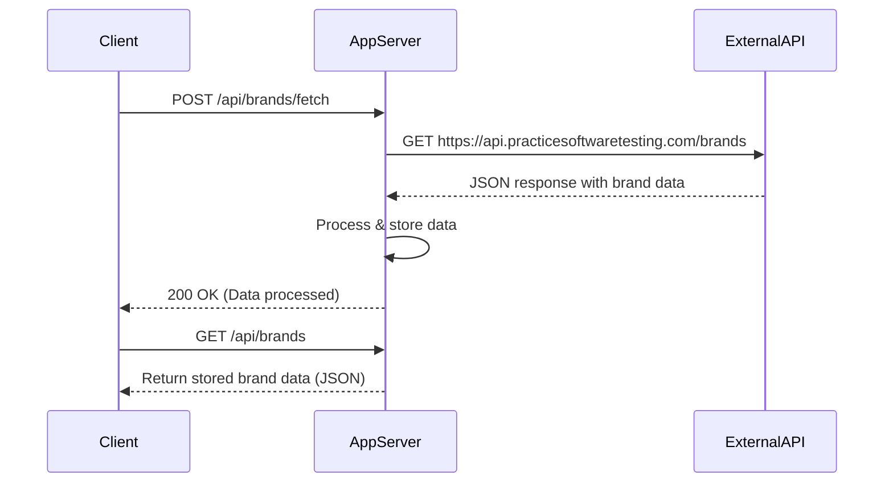
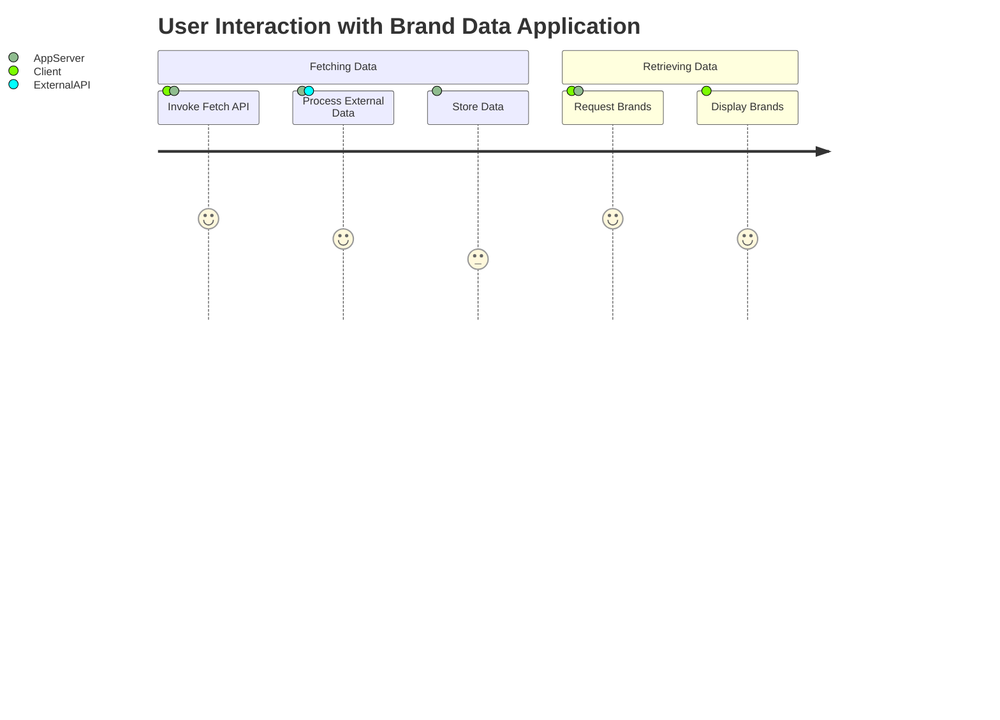

# Final Functional Requirements

## Overview
The application will serve as a backend service to fetch brand data from an external API and provide a structured way to access that data through its own API endpoints. 

## API Endpoints

### 1. POST /api/brands/fetch

**Description:**  
Triggers the retrieval of brand data from the external API at `https://api.practicesoftwaretesting.com/brands`. This endpoint will handle any necessary business logic including data transformation and storage.

**Request:**  
- **Method:** POST  
- **URL:** /api/brands/fetch  
- **Headers:** Content-Type: application/json  
- **Body (optional):**  
  ```json
  {
    "refresh": true
  }
  ```

**Response:**  
- **Status:** 200 OK  
- **Body:**  
  ```json
  {
    "status": "success",
    "message": "Brand data successfully fetched and processed.",
    "data": [ 
      {
        "id": "01JMWZK3N7PT3XMTMXMQTBACRV",
        "name": "ForgeFlex Tools",
        "slug": "forgeflex-tools"
      },
      {
        "id": "01JMWZK3N7PT3XMTMXMQTBACRW",
        "name": "MightyCraft Hardware",
        "slug": "mightycraft-hardware"
      }
    ]
  }
  ```

### 2. GET /api/brands

**Description:**  
Retrieves the stored brand data that was fetched and processed previously.

**Request:**  
- **Method:** GET  
- **URL:** /api/brands  
- **Headers:** Accept: application/json  

**Response:**  
- **Status:** 200 OK  
- **Body:**  
  ```json
  {
    "data": [ 
      {
        "id": "01JMWZK3N7PT3XMTMXMQTBACRV",
        "name": "ForgeFlex Tools",
        "slug": "forgeflex-tools"
      },
      {
        "id": "01JMWZK3N7PT3XMTMXMQTBACRW",
        "name": "MightyCraft Hardware",
        "slug": "mightycraft-hardware"
      }
    ]
  }
  ```

### 3. GET /api/brands/{brandId}

**Description:**  
Retrieves detailed information for a specific brand using its unique ID.

**Request:**  
- **Method:** GET  
- **URL:** /api/brands/{brandId}  
- **Headers:** Accept: application/json  

**Response:**  
- **Status:** 200 OK (if found)  
- **Body:**  
  ```json
  {
    "id": "01JMWZK3N7PT3XMTMXMQTBACRV",
    "name": "ForgeFlex Tools",
    "slug": "forgeflex-tools"
  }
  ```  
- **Status:** 404 Not Found (if the brand ID does not exist)  

## Business Logic Details
- The POST endpoint will invoke the external API and manage data validation, transformation, and storage.
- GET endpoints will only serve the processed data without making additional external API calls.

## User-App Interaction Diagrams

### Sequence Diagram


### Journey Diagram


This document outlines the final functional requirements, API interactions, and user-app interaction diagrams for your project.