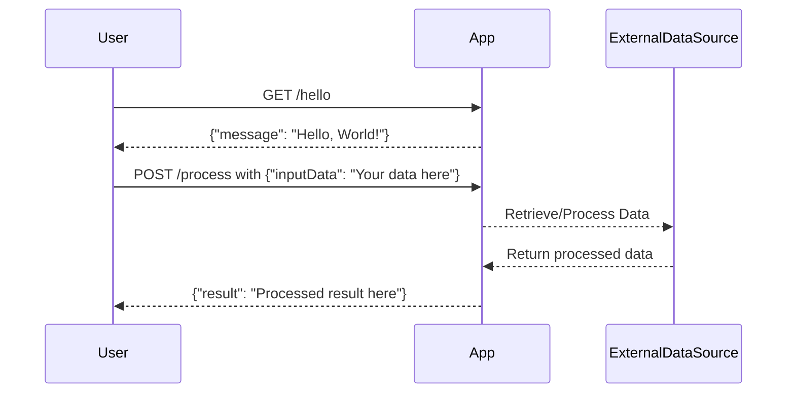

```markdown
# Final Functional Requirements Document

## API Endpoints

### 1. Hello World Endpoint
- **Endpoint:** `/hello`
- **Method:** GET
- **Description:** Returns a simple "Hello World" message.
- **Request Format:** None
- **Response Format:**
  - **Content-Type:** application/json
  - **Response Body:**
    ```json
    {
      "message": "Hello, World!"
    }
    ```

### 2. Data Processing Endpoint
- **Endpoint:** `/process`
- **Method:** POST
- **Description:** Accepts input data, processes it, and returns the result.
- **Request Format:**
  - **Content-Type:** application/json
  - **Request Body:**
    ```json
    {
      "inputData": "Your data here"
    }
    ```
- **Response Format:**
  - **Content-Type:** application/json
  - **Response Body:**
    ```json
    {
      "result": "Processed result here"
    }
    ```

## User-App Interaction Diagram


```