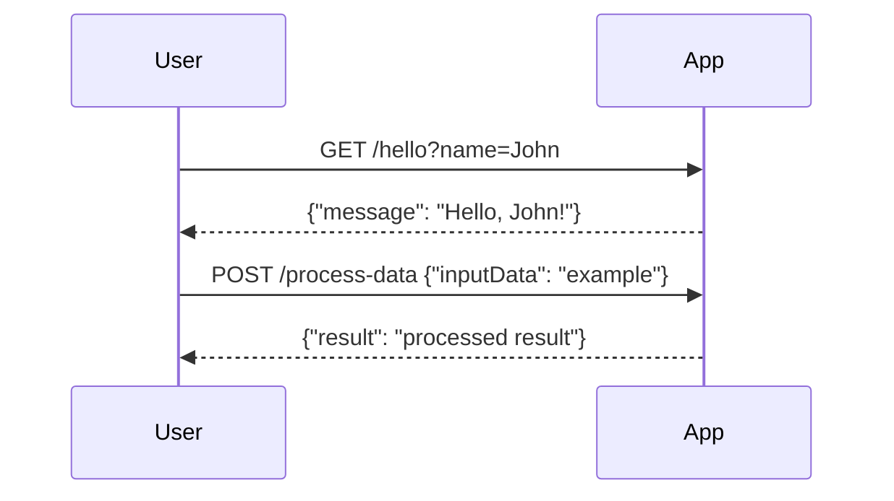
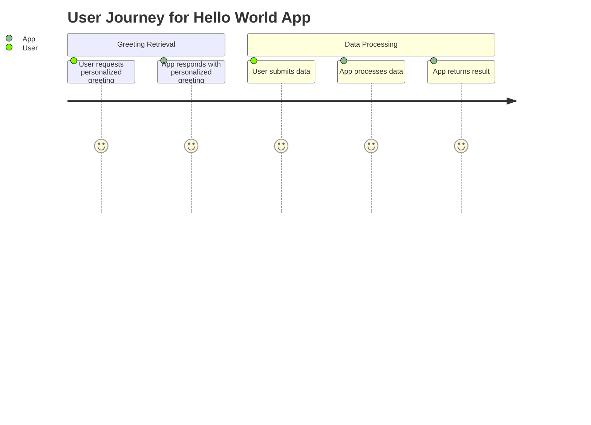

```markdown
# Final Functional Requirements Document

## API Endpoints

### 1. Hello Endpoint
- **Endpoint**: `/hello`
- **Method**: GET
- **Description**: Retrieves a personalized greeting message.
- **Request Format**:
    - Query Parameter:
        - `name`: (string) The name of the person to greet.
- **Response Format**:
    ```json
    {
        "message": "Hello, {name}!"
    }
    ```

### 2. Data Processing Endpoint
- **Endpoint**: `/process-data`
- **Method**: POST
- **Description**: Accepts data, performs calculations or retrieves external data, and returns results.
- **Request Format**:
    ```json
    {
        "inputData": "string or number"
    }
    ```
- **Response Format**:
    ```json
    {
        "result": "calculated result or retrieved data"
    }
    ```

## User-App Interaction Diagram

### Sequence Diagram


### Journey Diagram

```