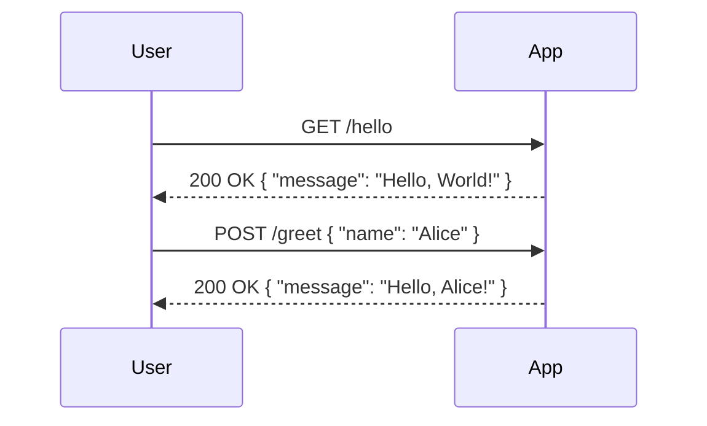

# Functional Requirements Document

## API Endpoints

### 1. Endpoint: `/hello`
- **Method**: GET
- **Description**: Returns a simple greeting message.
- **Request Format**: None
- **Response Format**: JSON
  - **Response Example**:
    ```json
    {
      "message": "Hello, World!"
    }
    ```

### 2. Endpoint: `/greet`
- **Method**: POST
- **Description**: Accepts a name and returns a personalized greeting.
- **Request Format**: JSON
  - **Request Body Example**:
    ```json
    {
      "name": "Alice"
    }
    ```
- **Response Format**: JSON
  - **Response Example**:
    ```json
    {
      "message": "Hello, Alice!"
    }
    ```

## User-App Interaction Diagram



This document outlines the confirmed functional requirements for the application.