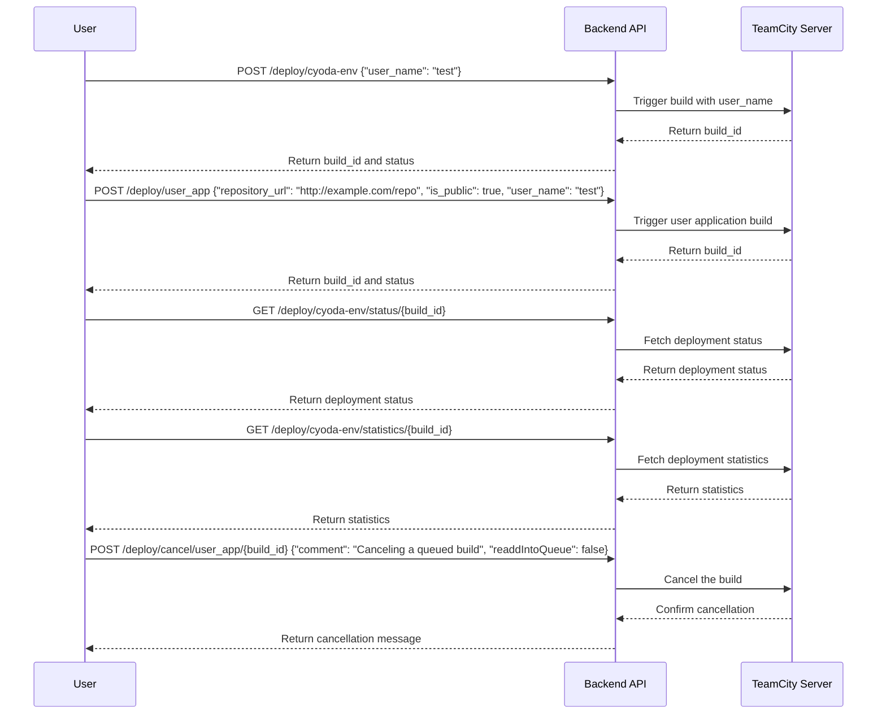

```markdown
# Functional Requirements for Deployment Management Application

## API Endpoints

### 1. Deploy Cyoda Environment
- **Endpoint**: `POST /deploy/cyoda-env`
- **Request Format**:
  ```json
  {
    "user_name": "test"
  }
  ```
- **Response Format**:
  ```json
  {
    "build_id": "12345",
    "status": "queued"
  }
  ```

### 2. Deploy User Application
- **Endpoint**: `POST /deploy/user_app`
- **Request Format**:
  ```json
  {
    "repository_url": "http://example.com/repo",
    "is_public": true,
    "user_name": "test"
  }
  ```
- **Response Format**:
  ```json
  {
    "build_id": "67890",
    "status": "queued"
  }
  ```

### 3. Get Cyoda Environment Deployment Status
- **Endpoint**: `GET /deploy/cyoda-env/status/{build_id}`
- **Response Format**:
  ```json
  {
    "build_id": "12345",
    "status": "running",
    "details": {
      "progress": "50%",
      "started_at": "2023-10-01T12:00:00Z"
    }
  }
  ```

### 4. Get Cyoda Environment Deployment Statistics
- **Endpoint**: `GET /deploy/cyoda-env/statistics/{build_id}`
- **Response Format**:
  ```json
  {
    "build_id": "12345",
    "statistics": {
      "duration": "10m",
      "success": true,
      "logs": "Log details here..."
    }
  }
  ```

### 5. Get User Application Deployment Status
- **Endpoint**: `GET /deploy/user_app/status/{build_id}`
- **Response Format**:
  ```json
  {
    "build_id": "67890",
    "status": "completed",
    "details": {
      "success": true,
      "ended_at": "2023-10-01T12:10:00Z"
    }
  }
  ```

### 6. Get User Application Deployment Statistics
- **Endpoint**: `GET /deploy/user_app/statistics/{build_id}`
- **Response Format**:
  ```json
  {
    "build_id": "67890",
    "statistics": {
      "duration": "15m",
      "success": false,
      "logs": "Error log details here..."
    }
  }
  ```

### 7. Cancel User Application Deployment
- **Endpoint**: `POST /deploy/cancel/user_app/{build_id}`
- **Request Format**:
  ```json
  {
    "comment": "Canceling a queued build",
    "readdIntoQueue": false
  }
  ```
- **Response Format**:
  ```json
  {
    "message": "Build cancelled successfully",
    "build_id": "67890"
  }
  ```

## User-App Interaction Diagram


```