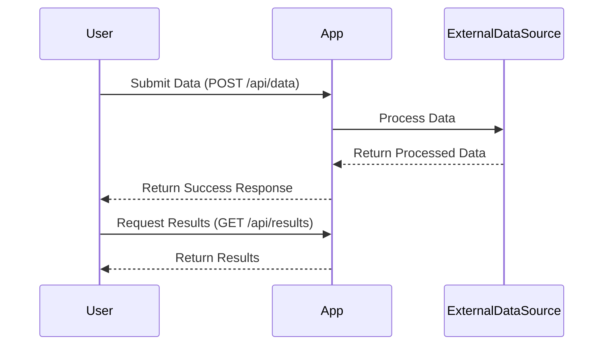

```markdown
# Functional Requirements for the Project

## API Endpoints

### 1. POST /api/data
- **Description**: This endpoint will be used to submit data for processing. It will invoke business logic to interact with an external data source.
- **Request Format**:
  - Content-Type: application/json
  - Body:
    ```json
    {
      "inputData": "string",
      "additionalParam": "string"
    }
    ```

- **Response Format**:
  - Status: 200 OK
  - Body:
    ```json
    {
      "result": "processedData",
      "message": "Data processed successfully"
    }
    ```

### 2. GET /api/results
- **Description**: This endpoint retrieves the results of the previously submitted data.
- **Request Format**: 
  - No request body required.
  
- **Response Format**:
  - Status: 200 OK
  - Body:
    ```json
    {
      "results": [
        {
          "id": "1",
          "data": "resultData1"
        },
        {
          "id": "2",
          "data": "resultData2"
        }
      ]
    }
    ```

## User-App Interaction Diagram


```