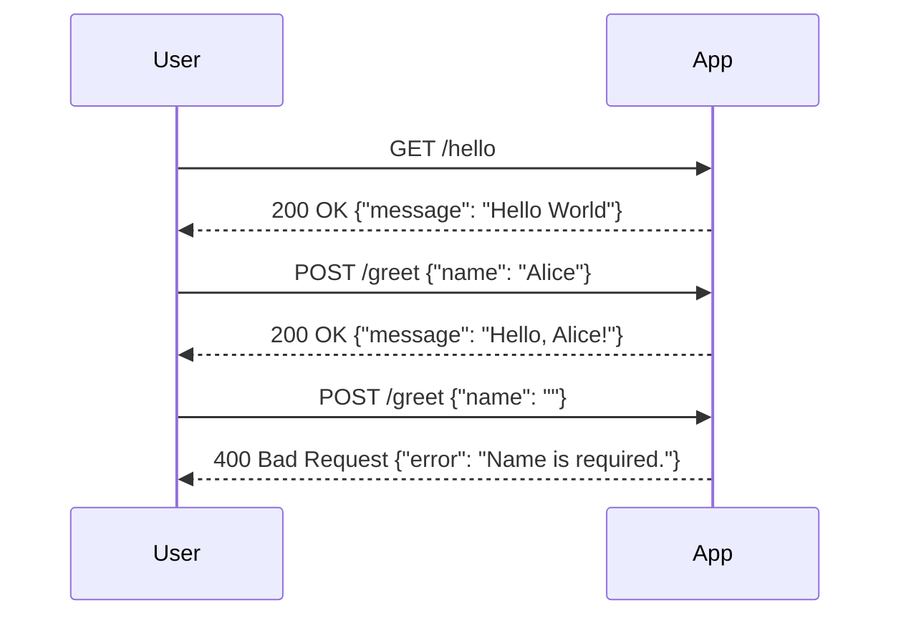

```markdown
# Final Functional Requirements for Hello World App

## API Endpoints

### 1. GET /hello
- **Description**: Retrieves a simple "Hello World" message.
- **Request Format**: 
  - No request body.
- **Response Format**: 
  - **200 OK**
    ```json
    {
      "message": "Hello World"
    }
    ```

### 2. POST /greet
- **Description**: Accepts a name and returns a personalized greeting.
- **Request Format**:
  - **Body**:
    ```json
    {
      "name": "string"
    }
    ```
- **Response Format**:
  - **200 OK**
    ```json
    {
      "message": "Hello, {name}!"
    }
    ```
  - **400 Bad Request** (if name is missing or invalid)
    ```json
    {
      "error": "Name is required."
    }
    ```

## User-App Interaction Diagram


```