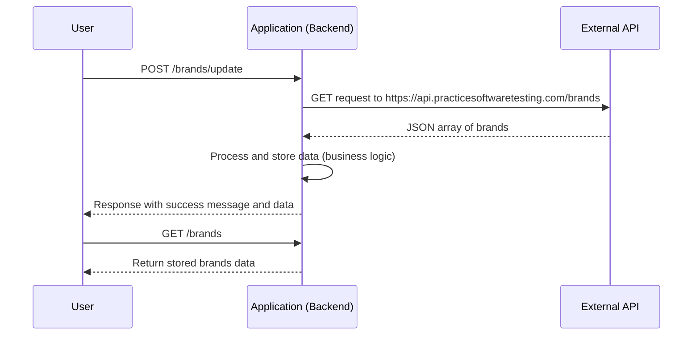
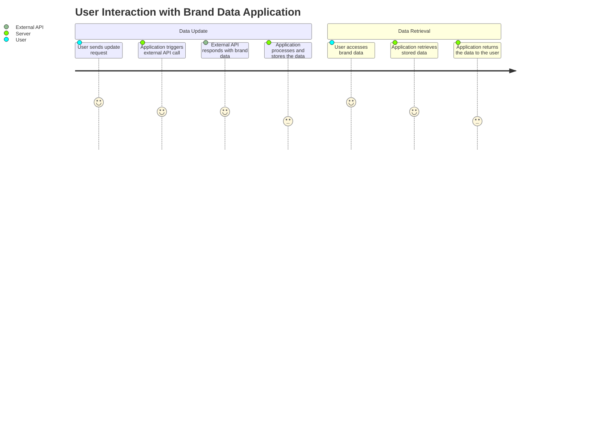

# Functional Requirements Specification

## API Endpoints

### 1. POST /brands/update
- **Purpose:**  
  Invoke the external API to retrieve brand data and perform necessary business logic (e.g., filtering, transformation, or calculations) before storing/updating the application results.

- **Request Format:**  
  - **Content-Type:** application/json  
  - **Request Body (optional parameters):**  
    ```json
    {
      "refresh": boolean, // Optional flag to force update
      "filter": string    // Optional filter criteria (if applicable)
    }
    ```

- **Response Format:**  
  - **Content-Type:** application/json  
  - **Success Response (HTTP 200):**  
    ```json
    {
      "message": "Brands data updated successfully.",
      "data": [
        {
          "id": "01JMWZK3N7PT3XMTMXMQTBACRV",
          "name": "ForgeFlex Tools",
          "slug": "forgeflex-tools"
        },
        {
          "id": "01JMWZK3N7PT3XMTMXMQTBACRW",
          "name": "MightyCraft Hardware",
          "slug": "mightycraft-hardware"
        }
      ]
    }
    ```
  - **Error Responses:** Include appropriate HTTP error codes (e.g., 400, 500) with error messages.

- **Business Logic:**  
  - Initiate an internal HTTP GET request to the external API: `https://api.practicesoftwaretesting.com/brands`.  
  - Validate and process the JSON array response (filter/calculations if needed).  
  - Persist or update the processed data in the application storage for future retrieval by the GET endpoint.

---

### 2. GET /brands
- **Purpose:**  
  Retrieve the updated list of brands stored in the application's data repository.

- **Request Format:**  
  - No request body is necessary.

- **Response Format:**  
  - **Content-Type:** application/json  
  - **Success Response (HTTP 200):**  
    ```json
    {
      "data": [
        {
          "id": "01JMWZK3N7PT3XMTMXMQTBACRV",
          "name": "ForgeFlex Tools",
          "slug": "forgeflex-tools"
        },
        {
          "id": "01JMWZK3N7PT3XMTMXMQTBACRW",
          "name": "MightyCraft Hardware",
          "slug": "mightycraft-hardware"
        }
      ]
    }
    ```
  - **No Data Response:** If no data exists, return an empty array or a relevant message.

---

## Diagrams

### Sequence Diagram



### User Journey Diagram

