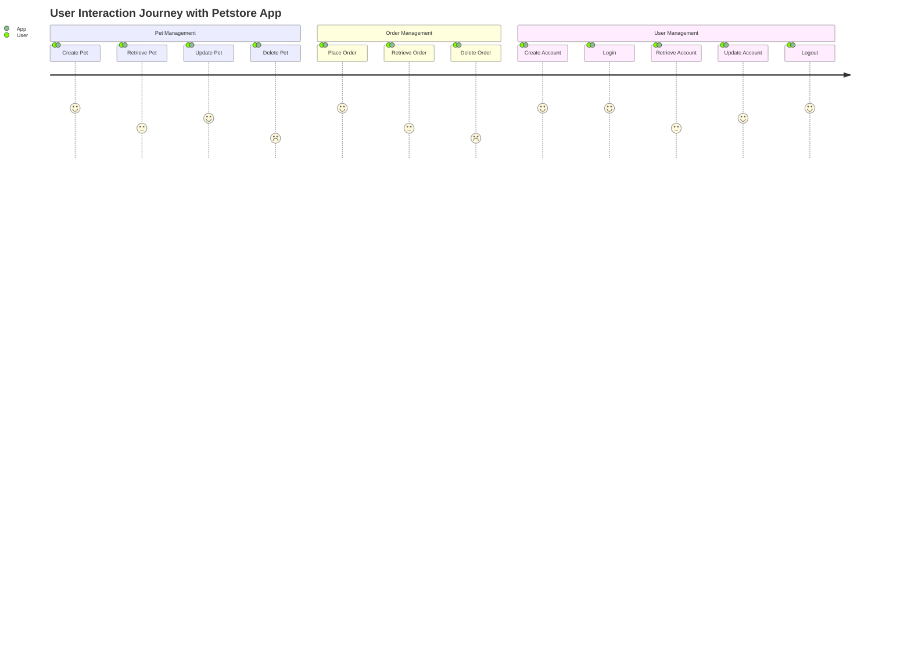
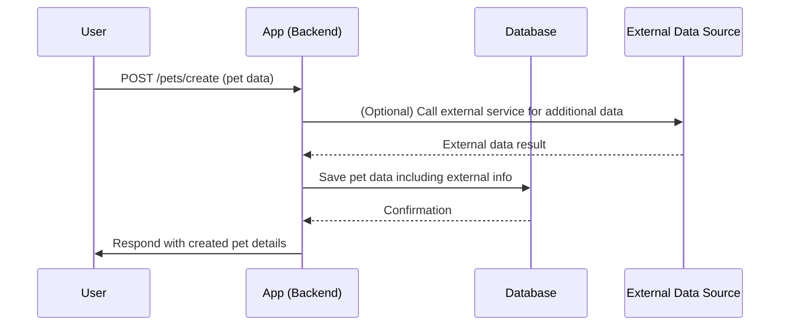

# Functional Requirements Document

## Overview
This document details the functional requirements for a backend application implementing the Petstore API. The application will adhere to RESTful principles, with specific rules for POST and GET requests.

## API Endpoints

### Pet Management

1. **Create Pet**  
   - **Method:** POST  
   - **Endpoint:** `/pets/create`  
   - **Request Body:**  
     ```json
     {
       "id": "integer",
       "name": "string",
       "category": "string",
       "photoUrls": ["string"],
       "tags": ["string"],
       "status": "available | pending | sold"
     }
     ```  
   - **Response Body:**  
     ```json
     {
       "success": true,
       "message": "Pet created successfully",
       "data": {
         "id": "integer",
         "name": "string",
         "category": "string",
         "photoUrls": ["string"],
         "tags": ["string"],
         "status": "available | pending | sold"
       }
     }
     ```

2. **Update Pet**  
   - **Method:** POST  
   - **Endpoint:** `/pets/update`  
   - **Request Body:** Similar to the create endpoint with updated fields.  
   - **Response Body:** Similar to create.

3. **Retrieve Pet by ID**  
   - **Method:** GET  
   - **Endpoint:** `/pets/{id}`  
   - **Response Body:**  
     ```json
     {
       "id": "integer",
       "name": "string",
       "category": "string",
       "photoUrls": ["string"],
       "tags": ["string"],
       "status": "available | pending | sold"
     }
     ```

4. **Delete Pet**  
   - **Method:** POST  
   - **Endpoint:** `/pets/delete`  
   - **Request Body:**  
     ```json
     {
       "id": "integer"
     }
     ```  
   - **Response Body:**  
     ```json
     {
       "success": true,
       "message": "Pet deleted successfully"
     }
     ```

5. **Upload Pet Image**  
   - **Method:** POST  
   - **Endpoint:** `/pets/uploadImage`  
   - **Request Body:** Form-data with pet id and image file.  
   - **Response Body:**  
     ```json
     {
       "success": true,
       "message": "Image uploaded successfully"
     }
     ```

### Order Management

1. **Place Order**  
   - **Method:** POST  
   - **Endpoint:** `/orders/create`  
   - **Request Body:**  
     ```json
     {
       "id": "integer",
       "petId": "integer",
       "quantity": "integer",
       "shipDate": "ISO8601 date string",
       "status": "placed | approved | delivered",
       "complete": "boolean"
     }
     ```  
   - **Response Body:**  
     ```json
     {
       "success": true,
       "message": "Order placed successfully",
       "data": {
         "id": "integer",
         "petId": "integer",
         "quantity": "integer",
         "shipDate": "ISO8601 date string",
         "status": "placed | approved | delivered",
         "complete": "boolean"
       }
     }
     ```

2. **Retrieve Order by ID**  
   - **Method:** GET  
   - **Endpoint:** `/orders/{id}`  
   - **Response Body:** Order details in JSON format as above.

3. **Delete Order**  
   - **Method:** POST  
   - **Endpoint:** `/orders/delete`  
   - **Request Body:**  
     ```json
     {
       "id": "integer"
     }
     ```  
   - **Response Body:**  
     ```json
     {
       "success": true,
       "message": "Order deleted successfully"
     }
     ```

### User Management

1. **Create User**  
   - **Method:** POST  
   - **Endpoint:** `/users/create`  
   - **Request Body:**  
     ```json
     {
       "id": "integer",
       "username": "string",
       "firstName": "string",
       "lastName": "string",
       "email": "string",
       "password": "string",
       "phone": "string",
       "userStatus": "integer"
     }
     ```  
   - **Response Body:**  
     ```json
     {
       "success": true,
       "message": "User created successfully",
       "data": { ... }
     }
     ```

2. **Update User**  
   - **Method:** POST  
   - **Endpoint:** `/users/update`  
   - **Request Body:** Similar to create endpoint.  
   - **Response Body:** Similar to create.

3. **User Login**  
   - **Method:** POST  
   - **Endpoint:** `/users/login`  
   - **Request Body:**  
     ```json
     {
       "username": "string",
       "password": "string"
     }
     ```  
   - **Response Body:**  
     ```json
     {
       "success": true,
       "message": "Login successful",
       "token": "JWT or session token string"
     }
     ```

4. **User Logout**  
   - **Method:** POST  
   - **Endpoint:** `/users/logout`  
   - **Request Body:** No body required or token-based as needed.  
   - **Response Body:**  
     ```json
     {
       "success": true,
       "message": "Logout successful"
     }
     ```

5. **Retrieve User by ID**  
   - **Method:** GET  
   - **Endpoint:** `/users/{id}`  
   - **Response Body:**  
     ```json
     {
       "id": "integer",
       "username": "string",
       "firstName": "string",
       "lastName": "string",
       "email": "string",
       "phone": "string",
       "userStatus": "integer"
     }
     ```

## Mermaid Diagrams

### User-App Interaction Journey



### API Sequence Diagram Example (Pet Creation Process)



This document provides a comprehensive overview of the functional requirements, including detailed API endpoints, request/response formats, and visual representations of user-app interactions.