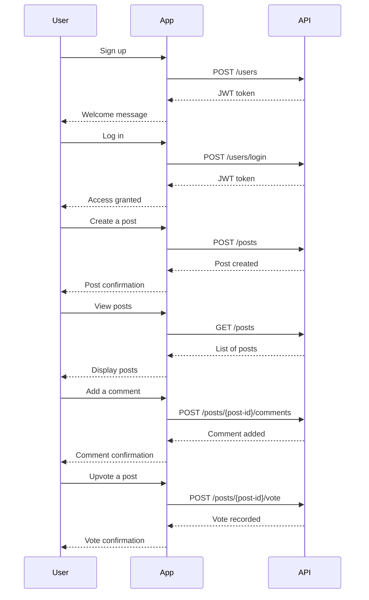

Here are the final functional requirements for your project, formatted clearly for easy understanding and implementation:

### Functional Requirements

#### 1. User Authentication

- **Sign Up**
  - As a user, I want to sign up to create an account.
  - **Endpoint**: `POST /users`
  - **Request**: `{ "username": "string", "password": "string" }`
  - **Response**: `{ "token": "JWT", "user_id": "string" }`

- **Log In**
  - As a user, I want to log in to access my account.
  - **Endpoint**: `POST /users/login`
  - **Request**: `{ "username": "string", "password": "string" }`
  - **Response**: `{ "token": "JWT", "user_id": "string" }`

#### 2. Post Management

- **Create Post**
  - As a user, I want to create a post with a title, tags, and body.
  - **Endpoint**: `POST /posts`
  - **Request**: `{ "title": "string", "tags": ["string"], "body": "string" }`
  - **Response**: `{ "post_id": "string", "message": "Post created successfully." }`

- **View Posts**
  - As a user, I want to view a list of posts to discover new content.
  - **Endpoint**: `GET /posts`
  - **Response**: `{ "posts": [{ "post_id": "string", "title": "string", "upvotes": "int", "downvotes": "int" }], "total": "int" }`

- **View Specific Post**
  - As a user, I want to view the details of a specific post.
  - **Endpoint**: `GET /posts/{post-id}`
  - **Response**: `{ "post_id": "string", "title": "string", "body": "string", "comments": [...] }`

- **Delete Post**
  - As a user, I want to delete my own posts.
  - **Endpoint**: `DELETE /posts/{post-id}`
  - **Response**: `{ "message": "Post deleted successfully." }`

#### 3. Comment Management

- **Add Comment**
  - As a user, I want to add comments to posts.
  - **Endpoint**: `POST /posts/{post-id}/comments`
  - **Request**: `{ "body": "string" }`
  - **Response**: `{ "comment_id": "int", "message": "Comment added successfully." }`

- **View Comments**
  - As a user, I want to view comments on a post.
  - **Endpoint**: `GET /posts/{post-id}/comments`
  - **Response**: `{ "comments": [{ "comment_id": "int", "body": "string", "upvotes": "int", "downvotes": "int" }] }`

- **Delete Comment**
  - As a user, I want to delete my own comments.
  - **Endpoint**: `DELETE /posts/{post-id}/comments/{comment-id}`
  - **Response**: `{ "message": "Comment deleted successfully." }`

#### 4. Image Management

- **Upload Image**
  - As a user, I want to upload images with my posts.
  - **Endpoint**: `POST /posts/{post-id}/images`
  - **Request**: `{ "image": "file" }`
  - **Response**: `{ "image_id": "string", "message": "Image uploaded successfully." }`

- **Retrieve Image**
  - As a user, I want to view images associated with a post.
  - **Endpoint**: `GET /posts/{post-id}/images/{image-id}`
  - **Response**: `{ "image_url": "string" }`

#### 5. Voting System

- **Vote on Post**
  - As a user, I want to upvote or downvote posts to express my opinion.
  - **Endpoint**: `POST /posts/{post-id}/vote`
  - **Request**: `{ "vote": "up" | "down" }`
  - **Response**: `{ "message": "Vote recorded." }`

- **Vote on Comment**
  - As a user, I want to upvote or downvote comments.
  - **Endpoint**: `POST /posts/{post-id}/comments/{comment-id}/vote`
  - **Request**: `{ "vote": "up" | "down" }`
  - **Response**: `{ "message": "Vote recorded." }`

### Visual Representation of User-App Interaction 

These functional requirements and user stories provide a comprehensive blueprint for developing your backend application. If you need further modifications or additional details, please let me know!