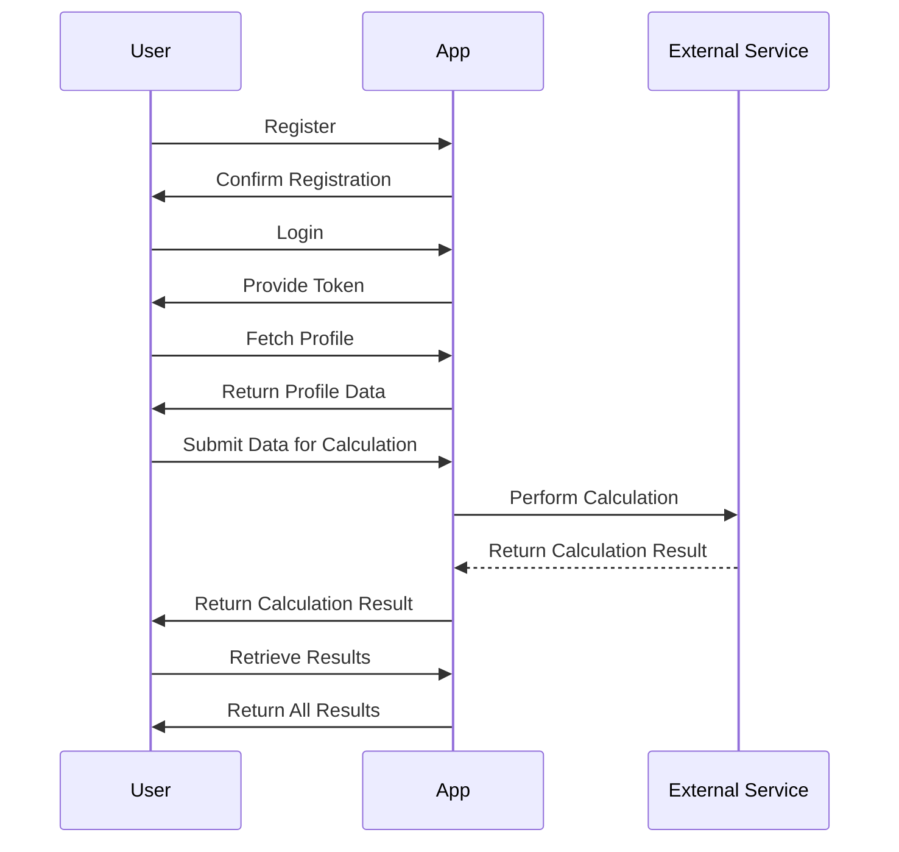

```markdown
# Functional Requirements Document

## API Endpoints

### 1. User Registration

- **Endpoint:** `POST /api/users/register`
- **Request Format:**
    ```json
    {
        "username": "string",
        "email": "string",
        "password": "string"
    }
    ```
- **Response Format:**
    ```json
    {
        "message": "User registered successfully",
        "userId": "string"
    }
    ```

### 2. User Login

- **Endpoint:** `POST /api/users/login`
- **Request Format:**
    ```json
    {
        "email": "string",
        "password": "string"
    }
    ```
- **Response Format:**
    ```json
    {
        "message": "Login successful",
        "token": "string"
    }
    ```

### 3. Fetch User Profile

- **Endpoint:** `GET /api/users/profile`
- **Response Format:**
    ```json
    {
        "userId": "string",
        "username": "string",
        "email": "string"
    }
    ```

### 4. Perform External Data Calculation

- **Endpoint:** `POST /api/data/calculate`
- **Request Format:**
    ```json
    {
        "inputData": "string"
    }
    ```
- **Response Format:**
    ```json
    {
        "result": "calculated value"
    }
    ```

### 5. Retrieve Calculation Results

- **Endpoint:** `GET /api/data/results`
- **Response Format:**
    ```json
    {
        "results": [
            {
                "inputData": "string",
                "result": "calculated value"
            }
        ]
    }
    ```

## User-App Interaction Diagram


```