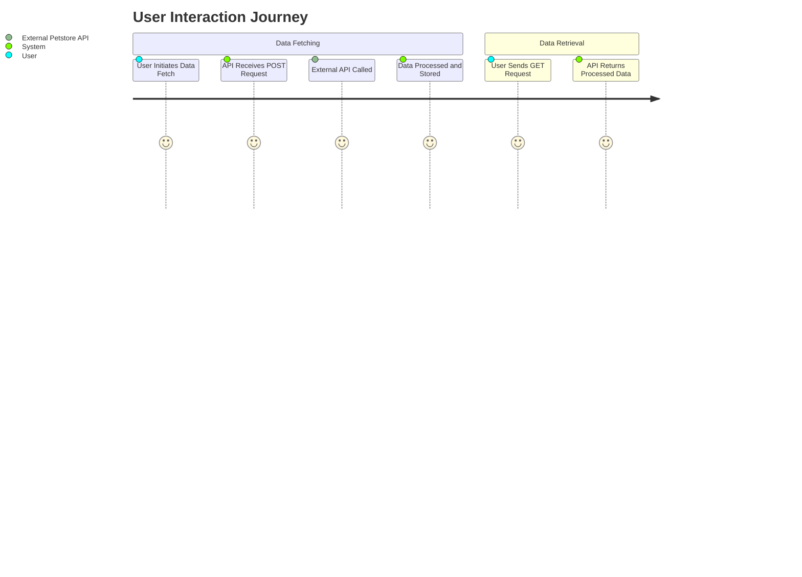
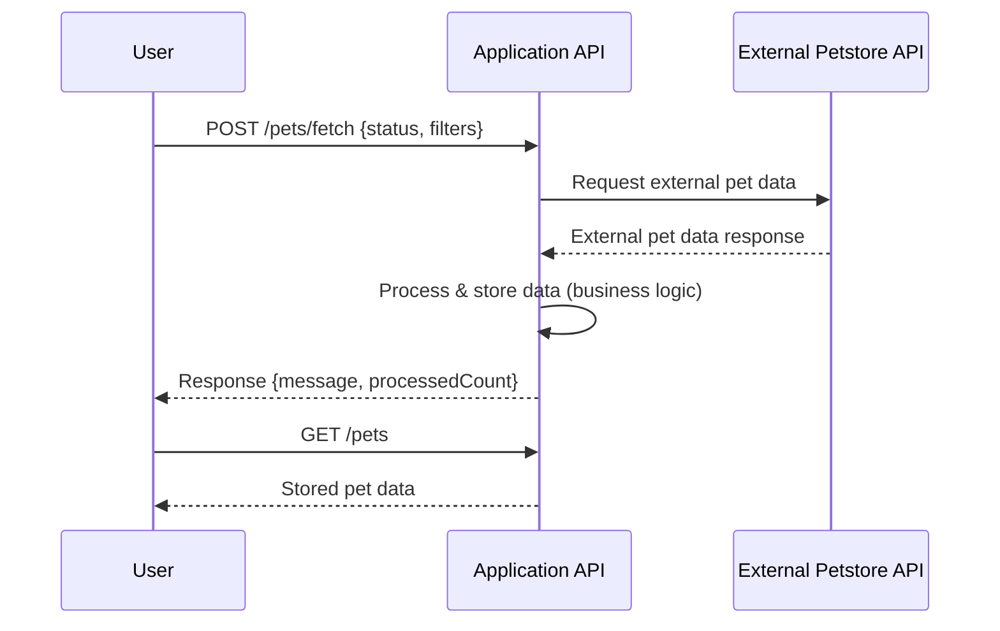
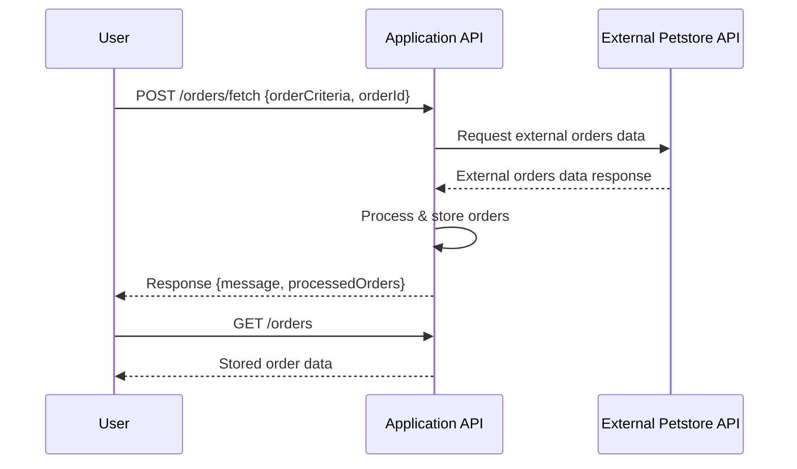
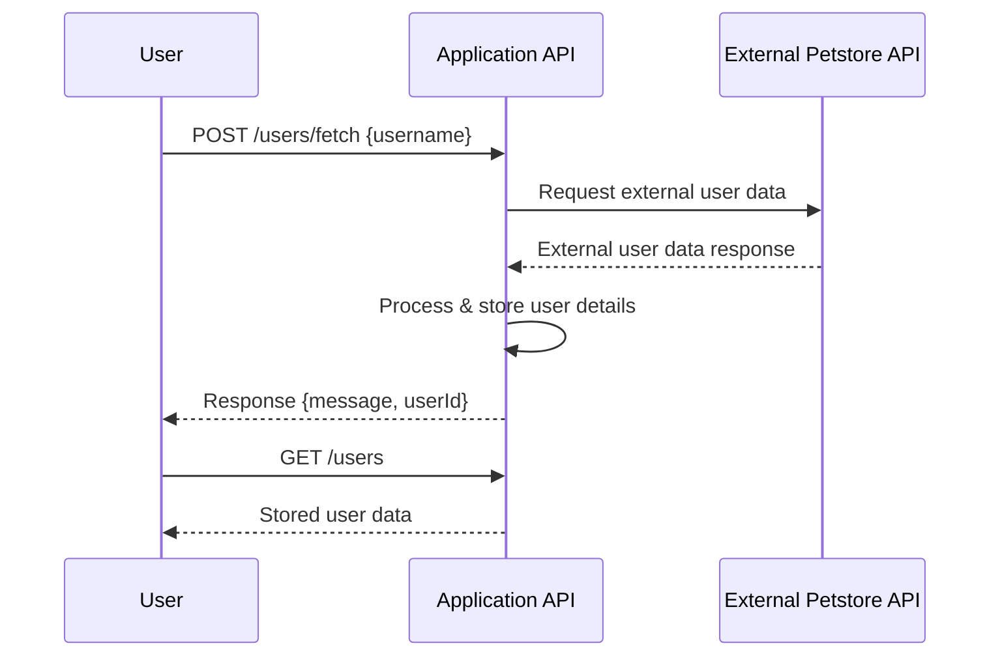

Answer:  
```markdown
# Functional Requirements Documentation

## Overview
This project is designed to fetch and process data from an external Petstore API and expose it via our own RESTful API. All operations that involve external data retrieval, business logic, or calculations must be implemented within POST endpoints. GET endpoints are strictly used to retrieve processed and stored application results.

## API Endpoints

### Pet-related Endpoints

- **POST /pets/fetch**  
  - **Purpose:** Invokes external Petstore API to fetch pet data, process any business logic (filtering, calculations, enrichment), and store results internally.  
  - **Request:**  
    ```json
    {
      "status": "available|pending|sold",
      "filters": {
        "minAge": 0,
        "maxAge": 100
      }
    }
    ```  
  - **Response:**  
    ```json
    {
      "message": "Data fetched and processed successfully.",
      "processedCount": 25
    }
    ```

- **GET /pets**  
  - **Purpose:** Retrieves stored pet results from the application database.  
  - **Response:**  
    ```json
    [
      {
        "id": 101,
        "name": "doggie",
        "status": "available",
        "photoUrls": ["url1", "url2"]
      }
    ]
    ```

### Order-related Endpoints

- **POST /orders/fetch**  
  - **Purpose:** Invokes external Petstore API to fetch order data, apply any required business logic including validations or calculations, and store processed results.  
  - **Request:**  
    ```json
    {
      "orderCriteria": "recent|byId",
      "orderId": 5
    }
    ```  
  - **Response:**  
    ```json
    {
      "message": "Orders fetched and processed successfully.",
      "processedOrders": 3
    }
    ```

- **GET /orders**  
  - **Purpose:** Retrieves internally stored order data.  
  - **Response:**  
    ```json
    [
      {
        "id": 5,
        "petId": 101,
        "quantity": 1,
        "status": "placed"
      }
    ]
    ```

### User-related Endpoints

- **POST /users/fetch**  
  - **Purpose:** Retrieves user information via the external API, applies business logic (e.g. role mapping, data enrichment), and stores the processed data.  
  - **Request:**  
    ```json
    {
      "username": "user1"
    }
    ```  
  - **Response:**  
    ```json
    {
      "message": "User data fetched and processed successfully.",
      "userId": 1001
    }
    ```

- **GET /users**  
  - **Purpose:** Retrieves stored user data from the application.  
  - **Response:**  
    ```json
    [
      {
        "id": 1001,
        "username": "user1",
        "email": "user1@example.com"
      }
    ]
    ```

## Error Handling
- In all POST endpoints, if external data retrieval fails or business logic encounters an issue, an error message with appropriate HTTP status codes (e.g., 400, 500) should be returned.
- GET endpoints should return a 404 status code with a message if no data is found.

## Mermaid Diagrams

### Journey Diagram


### Sequence Diagram





  
# End of Document
```
