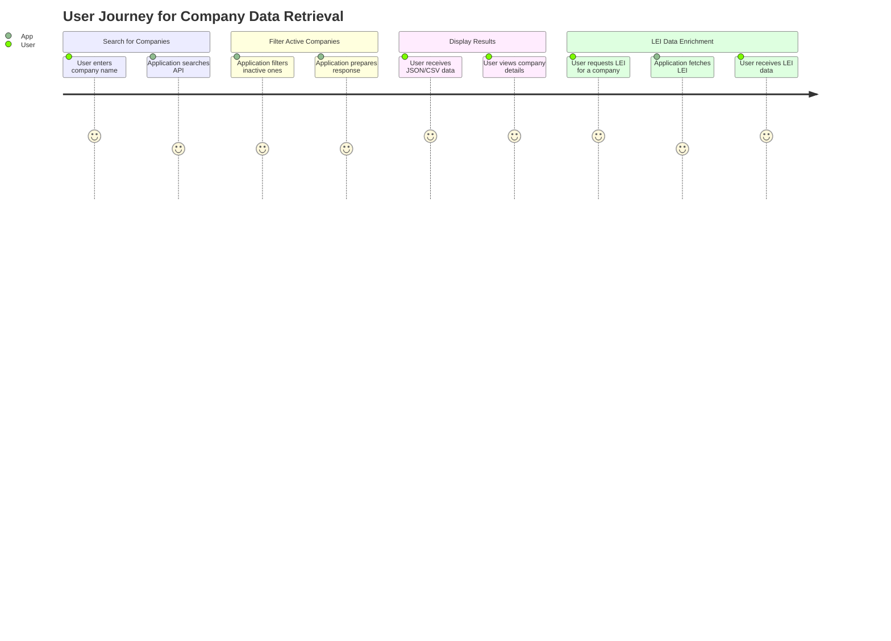

### Final Functional Requirements for Finnish Companies Data Retrieval and Enrichment Application

#### User Stories

1. **Data Retrieval User Story**
   - **As a** user, **I want** to search for companies by name, **so that** I can retrieve relevant company information from the Finnish Companies Registry.

2. **Filtering User Story**
   - **As a** user, **I want** to view only active companies in the search results, **so that** I can focus on relevant entities.

3. **LEI Data Enrichment User Story**
   - **As a** user, **I want** to see the Legal Entity Identifier (LEI) for each active company, **so that** I can have complete identification information.

4. **Output User Story**
   - **As a** user, **I want** the application to return the data in JSON or CSV format, **so that** I can easily use it in my reports or applications.

#### API Endpoints

1. **Search Companies**
   - **Endpoint**: `GET /companies`
   - **Request Parameters**:
     - `name` (string, required): Company name or partial name for search.
     - `location` (string, optional): Location for further filtering.
     - `businessId` (string, optional): Business ID for exact matching.
     - `page` (integer, optional): Page number for pagination.
   - **Response Format**:
     - **HTTP 200 OK**
     ```json
     {
       "results": [
         {
           "companyName": "Example Company",
           "businessId": "1234567-8",
           "companyType": "OY",
           "registrationDate": "2020-01-01",
           "status": "Active",
           "lei": "1234ABCDE"
         }
       ],
       "total": 1,
       "page": 1
     }
     ```

2. **Get Company LEI**
   - **Endpoint**: `GET /companies/{businessId}/lei`
   - **Response Format**:
     - **HTTP 200 OK**
     ```json
     {
       "businessId": "1234567-8",
       "lei": "1234ABCDE"
     }
     ```

#### User-App Interaction Journey



This document outlines the functional requirements in a clear format, enabling effective development and understanding of the application’s goals and capabilities.