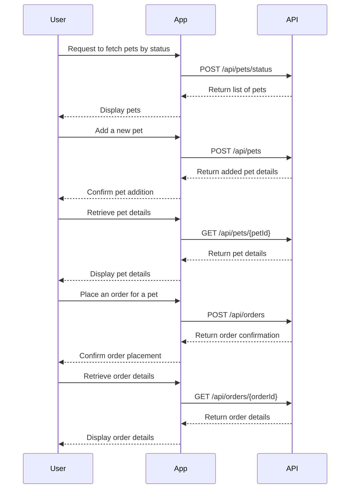

```markdown
# Functional Requirements Document

## API Endpoints

### 1. Fetch Pets by Status
- **Endpoint**: `/api/pets/status`
- **Method**: POST
- **Description**: Retrieve a list of pets based on their status.
- **Request Format**:
    ```json
    {
        "status": ["available", "pending", "sold"]
    }
    ```
- **Response Format**:
    ```json
    {
        "pets": [
            {
                "id": 1,
                "name": "Doggie",
                "status": "available",
                "photoUrls": ["url1", "url2"]
            },
            ...
        ]
    }
    ```

### 2. Add a New Pet
- **Endpoint**: `/api/pets`
- **Method**: POST
- **Description**: Add a new pet to the store.
- **Request Format**:
    ```json
    {
        "name": "Doggie",
        "status": "available",
        "photoUrls": ["url1", "url2"],
        "category": {
            "id": 1,
            "name": "Dogs"
        }
    }
    ```
- **Response Format**:
    ```json
    {
        "id": 1,
        "name": "Doggie",
        "status": "available"
    }
    ```

### 3. Retrieve Pet Details
- **Endpoint**: `/api/pets/{petId}`
- **Method**: GET
- **Description**: Retrieve details of a specific pet by its ID.
- **Request Format**: N/A (Path parameter)
- **Response Format**:
    ```json
    {
        "id": 1,
        "name": "Doggie",
        "status": "available",
        "photoUrls": ["url1", "url2"]
    }
    ```

### 4. Place an Order for a Pet
- **Endpoint**: `/api/orders`
- **Method**: POST
- **Description**: Place a new order for purchasing a pet.
- **Request Format**:
    ```json
    {
        "petId": 1,
        "quantity": 1,
        "status": "placed"
    }
    ```
- **Response Format**:
    ```json
    {
        "id": 1,
        "petId": 1,
        "quantity": 1,
        "status": "placed"
    }
    ```

### 5. Retrieve Order Details
- **Endpoint**: `/api/orders/{orderId}`
- **Method**: GET
- **Description**: Retrieve details of a specific order by its ID.
- **Request Format**: N/A (Path parameter)
- **Response Format**:
    ```json
    {
        "id": 1,
        "petId": 1,
        "quantity": 1,
        "status": "placed"
    }
    ```

## User-App Interaction Diagram


```