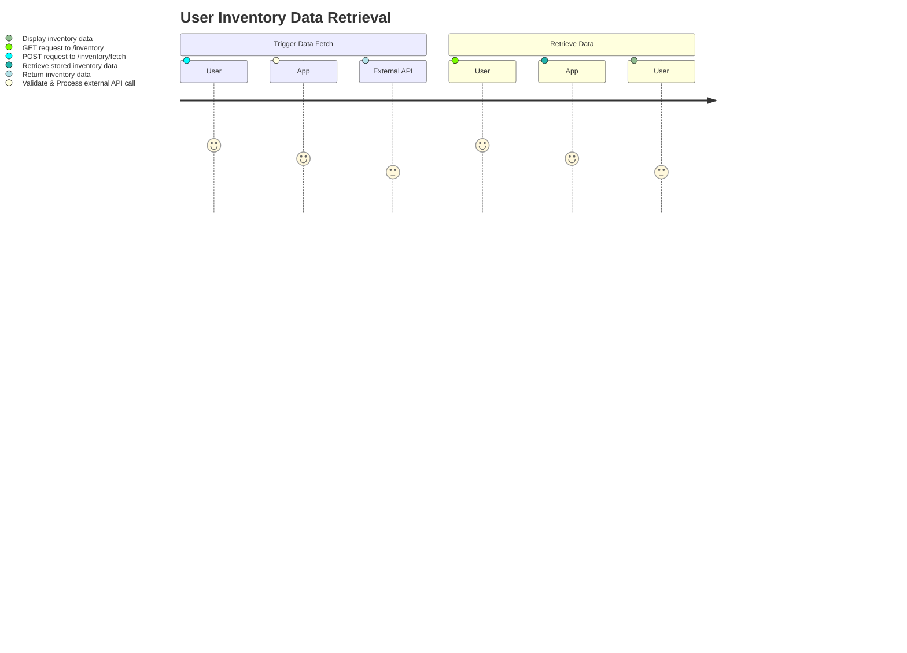
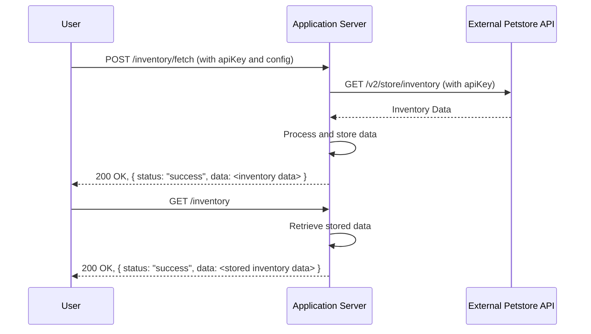

# Functional Requirements Document

## Overview

The application provides an interface to download inventory data from an external pet store API and exposes the fetched results to end users. All business logic or external API invocation is triggered via a POST endpoint, while GET endpoints are dedicated to retrieving stored results.

## API Endpoints

### 1. POST /inventory/fetch
- **Purpose:** Trigger an external API call to fetch the pet store inventory data.
- **Request:**
  - **Headers:** 
    - `Content-Type: application/json`
    - `Authorization: API key header (if required)`
  - **Body:** Optional configuration parameters (if needed).
    - **Example:**
      ```json
      {
        "externalApiUrl": "https://petstore.swagger.io/v2/store/inventory",
        "apiKey": "special-key"
      }
      ```
- **Response:**
  - **Success [HTTP 200]:**
    ```json
    {
      "status": "success",
      "data": { /* Inventory data retrieved from external API */ }
    }
    ```
  - **Failure [HTTP 4XX/5XX]:**
    ```json
    {
      "status": "error",
      "message": "Error message detailing what went wrong."
    }
    ```
- **Business Logic:**  
  - Validate request.
  - Call the external API to retrieve inventory data.
  - Perform any necessary filtering or calculations.
  - Store the transformed/filtered data for later retrieval.

### 2. GET /inventory
- **Purpose:** Retrieve the stored inventory results.
- **Request:**
  - **Headers:**  
    - `Accept: application/json`
- **Response:**
  - **Success [HTTP 200]:**
    ```json
    {
      "status": "success",
      "data": { /* Stored inventory data */ }
    }
    ```
  - **Failure [HTTP 4XX/5XX]:**
    ```json
    {
      "status": "error",
      "message": "Error message detailing what went wrong."
    }
    ```

## User-App Interaction Diagrams

### Journey Diagram


### Sequence Diagram
