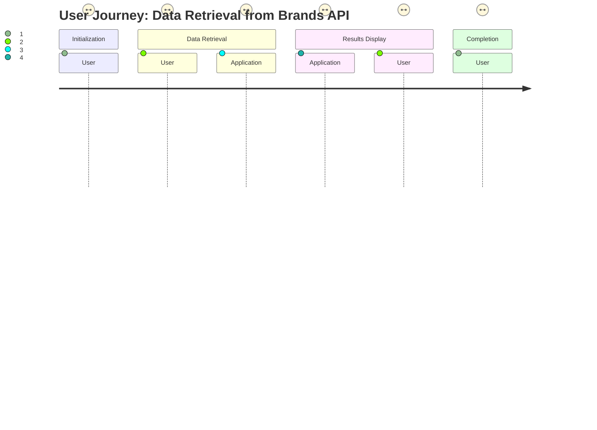
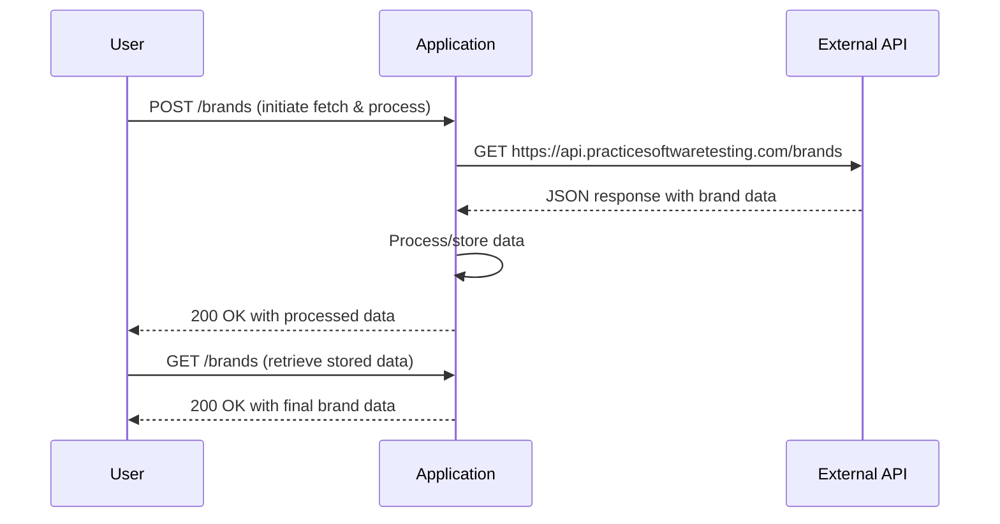

# Final Functional Requirements

## Overview

The application is designed to retrieve brand data from an external API and expose internal API endpoints that conform to RESTful principles. The application will handle data processing, filtering, and caching as needed, ensuring that all business logic is executed in designated POST endpoints.

## API Endpoints

### 1. POST /brands
- **Description:**  
  Initiates the process of retrieving brand data from the external API and applies necessary business logic.

- **Request:**
  - **Method:** POST
  - **URL:** `/brands`
  - **Headers:**  
    - `Content-Type: application/json`
  - **Body:**  
    An optional JSON payload for filter criteria or other parameters.  
    **Example:**
    ```json
    {
      "filter": "optional filter criteria"
    }
    ```

- **Business Logic:**
  - Call the external API (GET request).
  - Process and optionally cache or enrich the returned data.
  - Validate data and perform any required transformations.

- **Response:**
  - **Status:** 200 OK (if successful)
  - **Body:**  
    A JSON array containing the processed list of brands.  
    **Example:**
    ```json
    [
      {
        "id": "01JMWZK3N7PT3XMTMXMQTBACRV",
        "name": "ForgeFlex Tools",
        "slug": "forgeflex-tools"
      },
      {
        "id": "01JMWZK3N7PT3XMTMXMQTBACRW",
        "name": "MightyCraft Hardware",
        "slug": "mightycraft-hardware"
      }
    ]
    ```
  - **Error Codes:**  
    - 400 – for malformed requests.  
    - 500 – for internal server errors.

### 2. GET /brands
- **Description:**  
  Retrieves the final, processed brand data stored by the POST endpoint.

- **Request:**
  - **Method:** GET
  - **URL:** `/brands`
  - No body required.

- **Response:**
  - **Status:** 200 OK (if data is available)
  - **Body:**  
    A JSON array containing the list of processed brands, following the same structure as the POST response.
  - **Error Codes:**  
    - 404 – if no data is available.  
    - 500 – for internal server errors.

## User-App Interaction Diagrams

### Journey Diagram


### Sequence Diagram
