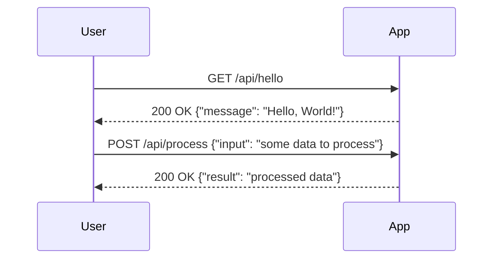
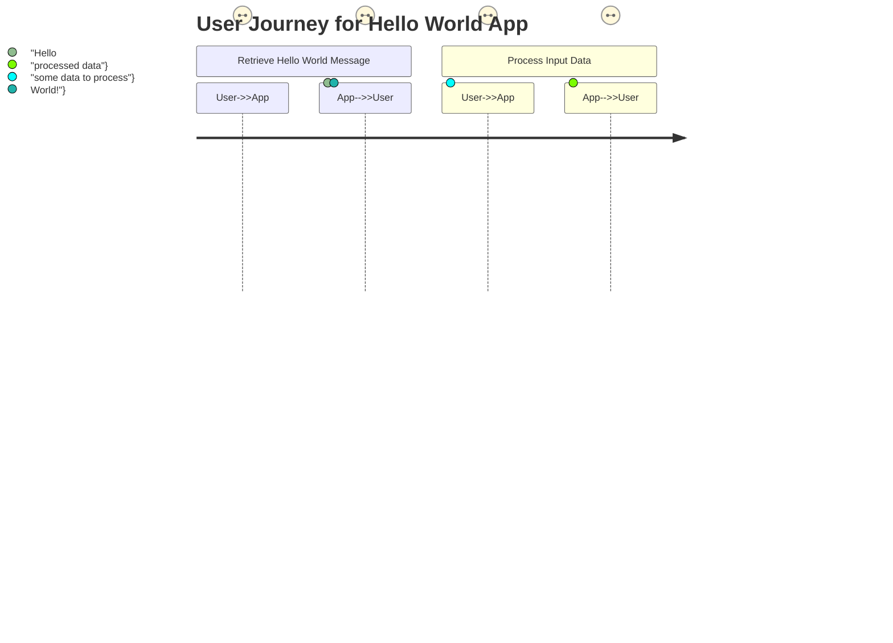

```markdown
# Functional Requirements Document

## API Endpoints

### 1. Endpoint: Hello World (GET)
- **Description**: Retrieve a simple "Hello, World!" message.
- **Method**: GET
- **URL**: `/api/hello`
- **Request Format**: None
- **Response Format**:
  - **200 OK**
  ```json
  {
    "message": "Hello, World!"
  }
  ```

### 2. Endpoint: Process Data (POST)
- **Description**: Process input data and return a result.
- **Method**: POST
- **URL**: `/api/process`
- **Request Format**:
  ```json
  {
    "input": "some data to process"
  }
  ```
- **Response Format**:
  - **200 OK**
  ```json
  {
    "result": "processed data"
  }
  ```
  - **400 Bad Request**
  ```json
  {
    "error": "Invalid input"
  }
  ```

## User-App Interaction




```