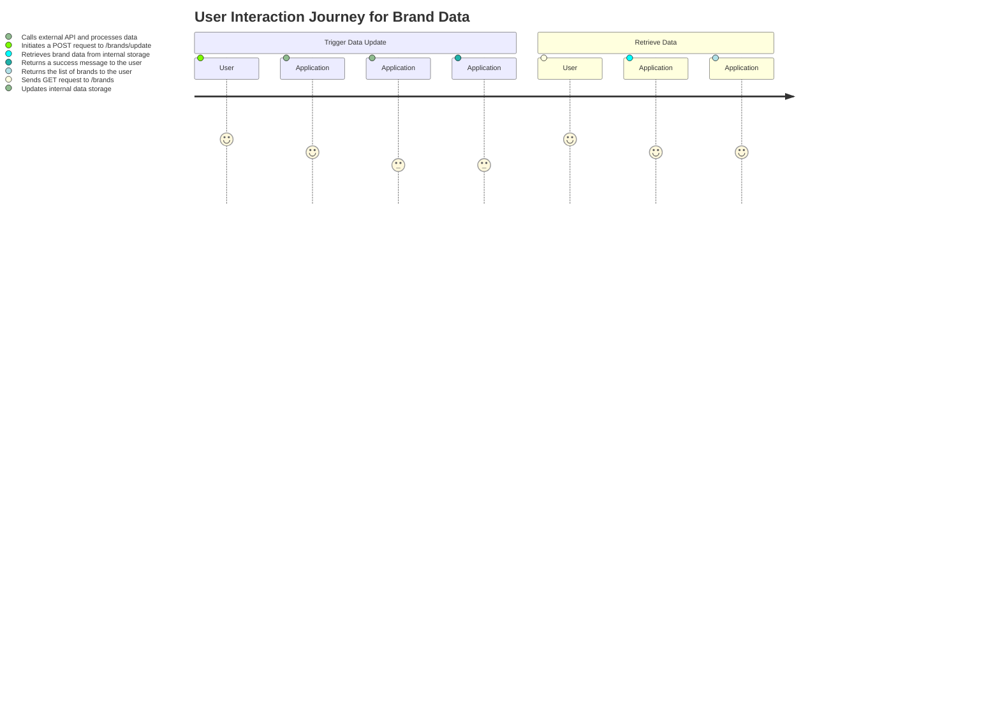
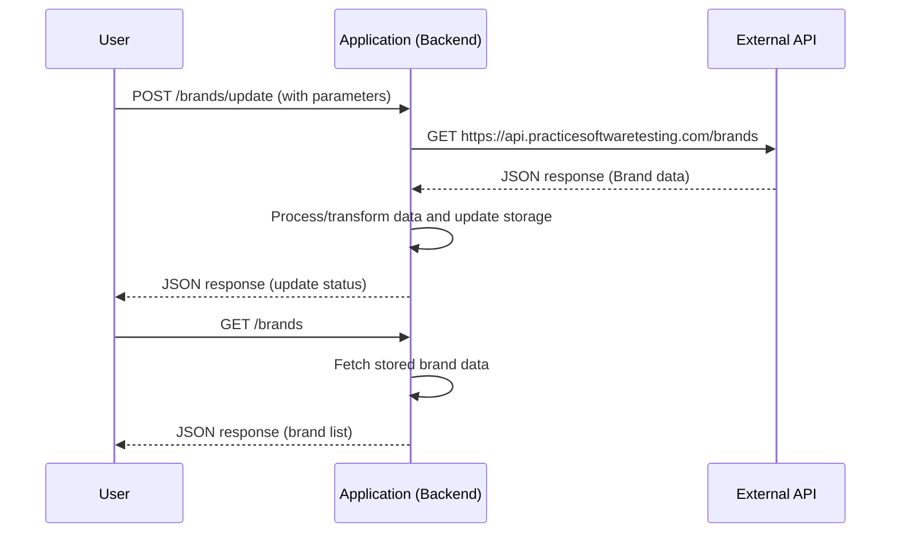

# Functional Requirements Document

## Project Overview
This document outlines the functional requirements for a backend application that retrieves and displays brand data from an external API.

## API Endpoints

### 1. POST /brands/update
- **Purpose:** 
  - Trigger the integration with the external data source.
  - Invoke any business logic necessary (e.g., data transformation, calculations).
  - Store or update the latest brand data in the internal system.
  
- **Request Format:**  
  - **Method:** POST  
  - **Headers:** 
    - Content-Type: application/json  
  - **Body:** 
    ```json
    {
      "trigger": "manual"
    }
    ```
  
- **Response Format:**  
  - **On Success:**
    ```json
    {
      "status": "success",
      "message": "Brand data updated successfully",
      "data": [ /* optional: include the updated brand data */ ]
    }
    ```
  - **On Failure:**
    ```json
    {
      "status": "error",
      "message": "Unable to update brand data, please try again later"
    }
    ```

### 2. GET /brands
- **Purpose:** 
  - Retrieve the stored brand data that was updated via the POST endpoint.
  
- **Request Format:**  
  - **Method:** GET  
  - **Headers:** 
    - Accept: application/json  
  
- **Response Format:**  
  - Example JSON response:
    ```json
    [
      {
        "id": "01JMWZK3N7PT3XMTMXMQTBACRV",
        "name": "ForgeFlex Tools",
        "slug": "forgeflex-tools"
      },
      {
        "id": "01JMWZK3N7PT3XMTMXMQTBACRW",
        "name": "MightyCraft Hardware",
        "slug": "mightycraft-hardware"
      }
    ]
    ```

## Business Logic Summary
- All business logic including external data retrieval and possible data transformations must be encapsulated in the POST endpoint.
- The GET endpoint is exclusively used for fetching stored results from the application's internal data store, ensuring RESTful separation between data updating/calculations (POST) and data retrieval (GET).

## User Interaction Journey


## Sequence Diagram for Data Update Process


This set of functional requirements provides a clear outline for the development of the backend application, ensuring that all necessary components and interactions are defined.