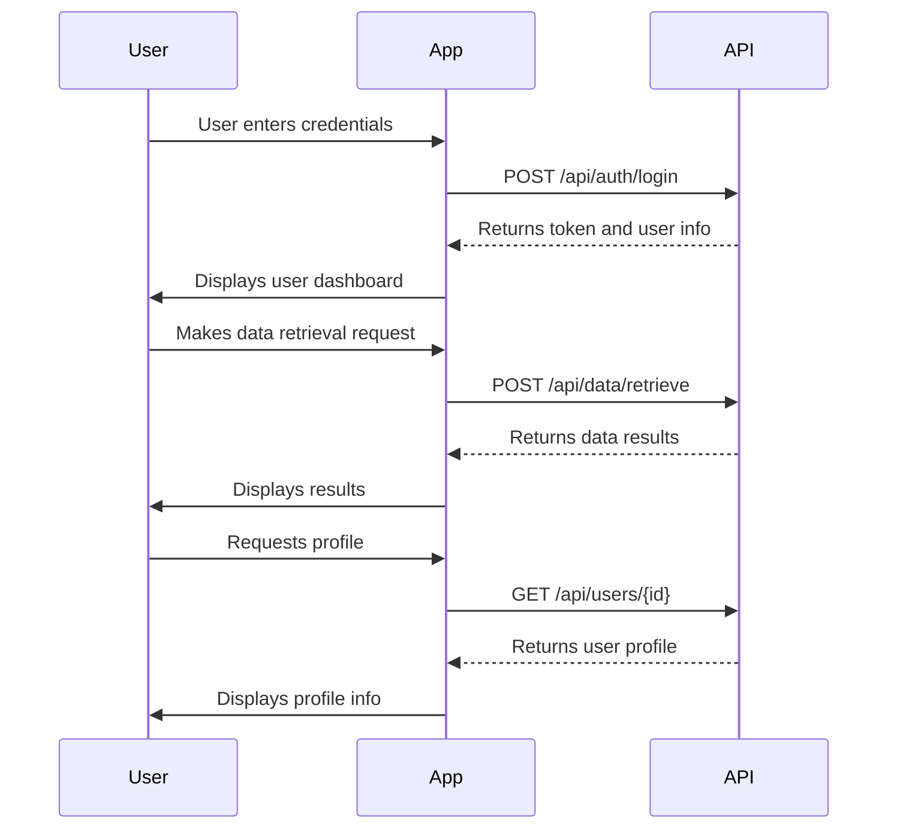

```markdown
# Final Functional Requirements for Cyoda App

## API Endpoints

### 1. User Authentication

- **POST /api/auth/login**
  - **Request**: 
    ```json
    {
      "username": "string",
      "password": "string"
    }
    ```
  - **Response**: 
    ```json
    {
      "token": "string",
      "user": {
        "id": "integer",
        "username": "string",
        "roles": ["string"]
      }
    }
    ```

- **POST /api/auth/register**
  - **Request**: 
    ```json
    {
      "username": "string",
      "password": "string",
      "email": "string"
    }
    ```
  - **Response**: 
    ```json
    {
      "message": "User registered successfully."
    }
    ```

### 2. Data Management

- **POST /api/data/retrieve**
  - **Request**: 
    ```json
    {
      "query": "string"
    }
    ```
  - **Response**: 
    ```json
    {
      "results": [
        {
          "id": "integer",
          "data": "string"
        }
      ]
    }
    ```

- **GET /api/data/results**
  - **Response**: 
    ```json
    {
      "results": [
        {
          "id": "integer",
          "data": "string"
        }
      ]
    }
    ```

### 3. User Profile

- **GET /api/users/{id}**
  - **Response**:
    ```json
    {
      "id": "integer",
      "username": "string",
      "email": "string",
      "roles": ["string"]
    }
    ```

## User-App Interaction Diagram


```