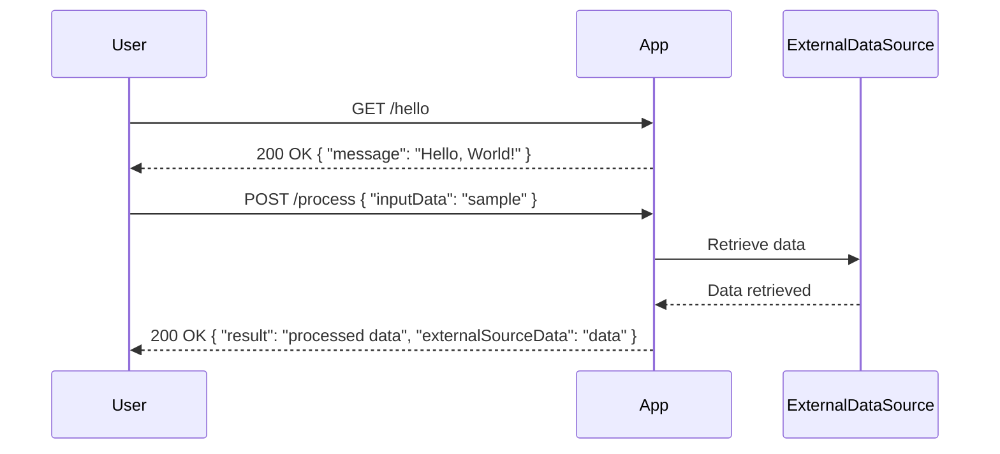

```markdown
# Functional Requirements for the Project

## API Endpoints

### 1. Hello World Endpoint
- **Endpoint**: `/hello`
- **Method**: `GET`
- **Description**: Retrieves a simple "Hello, World!" message.
- **Request Format**: None
- **Response Format**:
  - **200 OK**
    ```json
    {
      "message": "Hello, World!"
    }
    ```

### 2. Process Data Endpoint
- **Endpoint**: `/process`
- **Method**: `POST`
- **Description**: Processes data sent in the request and may invoke external data sources for calculations or additional information.
- **Request Format**:
  ```json
  {
    "inputData": "string or object"
  }
  ```
- **Response Format**:
  - **200 OK**
    ```json
    {
      "result": "processed data",
      "externalSourceData": "data from external source"
    }
    ```
  - **400 Bad Request**
    ```json
    {
      "error": "Invalid input data"
    }
    ```

## User-App Interaction Visual Representation


```