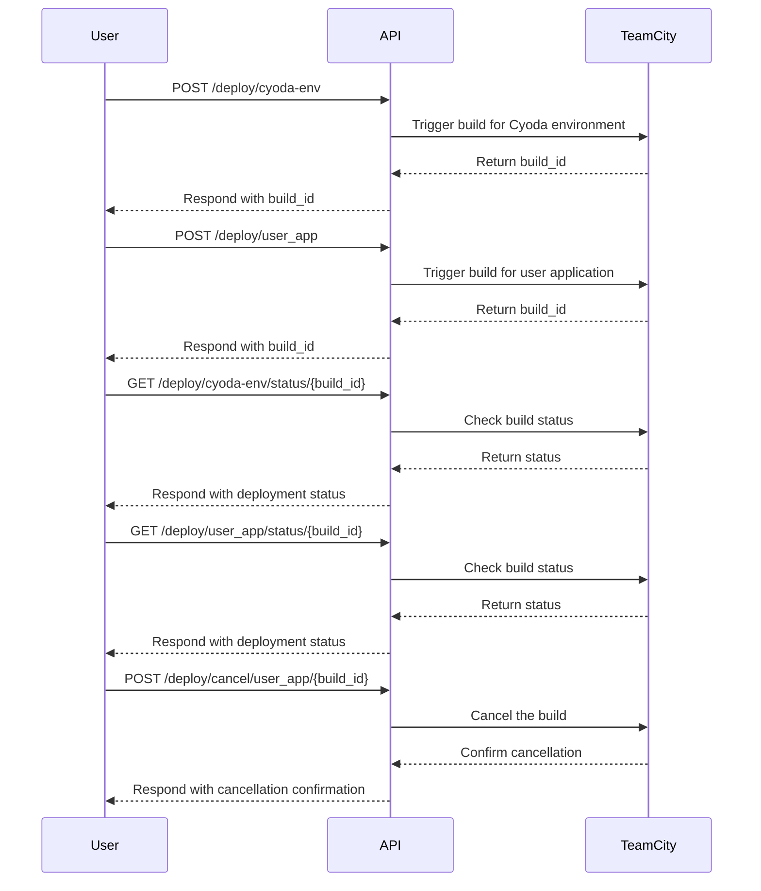

# Final Functional Requirements

## Overview
This document outlines the functional requirements for an application that manages deployment and environment configuration for multiple users. The application will provide a RESTful API to facilitate deployment processes while ensuring user authentication and data integrity.

## API Endpoints

### 1. Deploy Cyoda Environment
- **Endpoint:** `POST /deploy/cyoda-env`
- **Description:** Triggers the deployment of a Cyoda environment.
- **Request Body:**
    ```json
    {
      "user_name": "test"
    }
    ```
- **Response:**
  - **Status Code:** `201 Created`
  - **Body:**
    ```json
    {
      "build_id": "12345"
    }
    ```

### 2. Deploy User Application
- **Endpoint:** `POST /deploy/user_app`
- **Description:** Deploys a user application based on a repository URL.
- **Request Body:**
    ```json
    {
      "repository_url": "http://....",
      "is_public": "true",
      "user_name": "test"
    }
    ```
- **Response:**
  - **Status Code:** `201 Created`
  - **Body:**
    ```json
    {
      "build_id": "67890"
    }
    ```

### 3. Get Cyoda Environment Deployment Status
- **Endpoint:** `GET /deploy/cyoda-env/status/{build_id}`
- **Description:** Retrieves the deployment status of the Cyoda environment.
- **Response:**
  - **Status Code:** `200 OK`
  - **Body:**
    ```json
    {
      "status": "success",
      "details": "Deployment is currently running."
    }
    ```

### 4. Get Cyoda Environment Deployment Statistics
- **Endpoint:** `GET /deploy/cyoda-env/statistics/{build_id}`
- **Description:** Provides statistics related to the Cyoda environment deployment.
- **Response:**
  - **Status Code:** `200 OK`
  - **Body:**
    ```json
    {
      "statistics": {
        "duration": "5m",
        "success": true
      }
    }
    ```

### 5. Get User Application Deployment Status
- **Endpoint:** `GET /deploy/user_app/status/{build_id}`
- **Description:** Retrieves the deployment status of the user application.
- **Response:**
  - **Status Code:** `200 OK`
  - **Body:**
    ```json
    {
      "status": "success",
      "details": "Deployment is currently running."
    }
    ```

### 6. Get User Application Deployment Statistics
- **Endpoint:** `GET /deploy/user_app/statistics/{build_id}`
- **Description:** Provides statistics related to the user application deployment.
- **Response:**
  - **Status Code:** `200 OK`
  - **Body:**
    ```json
    {
      "statistics": {
        "duration": "4m",
        "success": false
      }
    }
    ```

### 7. Cancel User Application Deployment
- **Endpoint:** `POST /deploy/cancel/user_app/{build_id}`
- **Description:** Cancels an ongoing user application deployment.
- **Request Body:**
    ```json
    {
      "comment": "Canceling a queued build",
      "readdIntoQueue": false
    }
    ```
- **Response:**
  - **Status Code:** `200 OK`
  - **Body:**
    ```json
    {
      "message": "Deployment canceled successfully."
    }
    ```

## User-App Interaction Diagram



This document provides a comprehensive overview of the functional requirements for the deployment management application, ensuring clarity for future development and implementation.