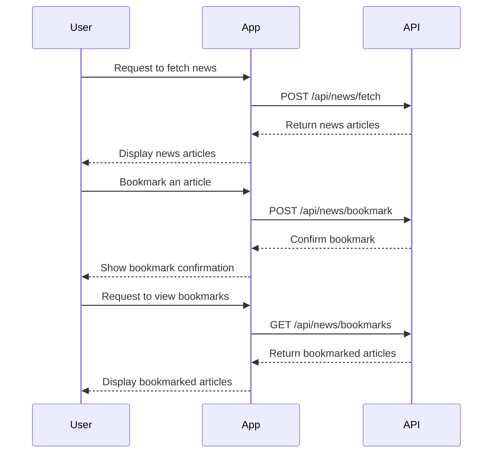

```markdown
# Functional Requirements for News Collection App

## API Endpoints

### 1. **POST /api/news/fetch**
- **Description**: Fetch news articles from specified external sources.
- **Request Format**:
  ```json
  {
    "sources": ["source1", "source2"],
    "categories": ["technology", "sports"],
    "keywords": ["keyword1", "keyword2"]
  }
  ```
- **Response Format**:
  ```json
  {
    "status": "success",
    "data": [
      {
        "title": "Article Title",
        "url": "https://example.com/article",
        "source": "source1",
        "category": "technology",
        "publishedAt": "2023-04-11T12:00:00Z"
      }
    ]
  }
  ```

### 2. **GET /api/news**
- **Description**: Retrieve stored news articles in the database.
- **Request Parameters**:
  - `category` (optional): Filter by category.
  - `limit` (optional): Number of articles to return.
  - `offset` (optional): Pagination offset.
- **Response Format**:
  ```json
  {
    "status": "success",
    "data": [
      {
        "id": 1,
        "title": "Stored Article Title",
        "url": "https://example.com/article",
        "source": "source1",
        "category": "technology",
        "publishedAt": "2023-04-11T12:00:00Z"
      }
    ]
  }
  ```

### 3. **POST /api/news/bookmark**
- **Description**: Bookmark a specific news article for the user.
- **Request Format**:
  ```json
  {
    "userId": "user123",
    "articleId": 1
  }
  ```
- **Response Format**:
  ```json
  {
    "status": "success",
    "message": "Article bookmarked successfully"
  }
  ```

### 4. **GET /api/news/bookmarks**
- **Description**: Retrieve bookmarked articles for a specific user.
- **Request Parameters**:
  - `userId`: The ID of the user.
- **Response Format**:
  ```json
  {
    "status": "success",
    "data": [
      {
        "id": 1,
        "title": "Bookmarked Article Title",
        "url": "https://example.com/article",
        "source": "source1",
        "category": "technology",
        "publishedAt": "2023-04-11T12:00:00Z"
      }
    ]
  }
  ```

## User-App Interaction Diagram


```