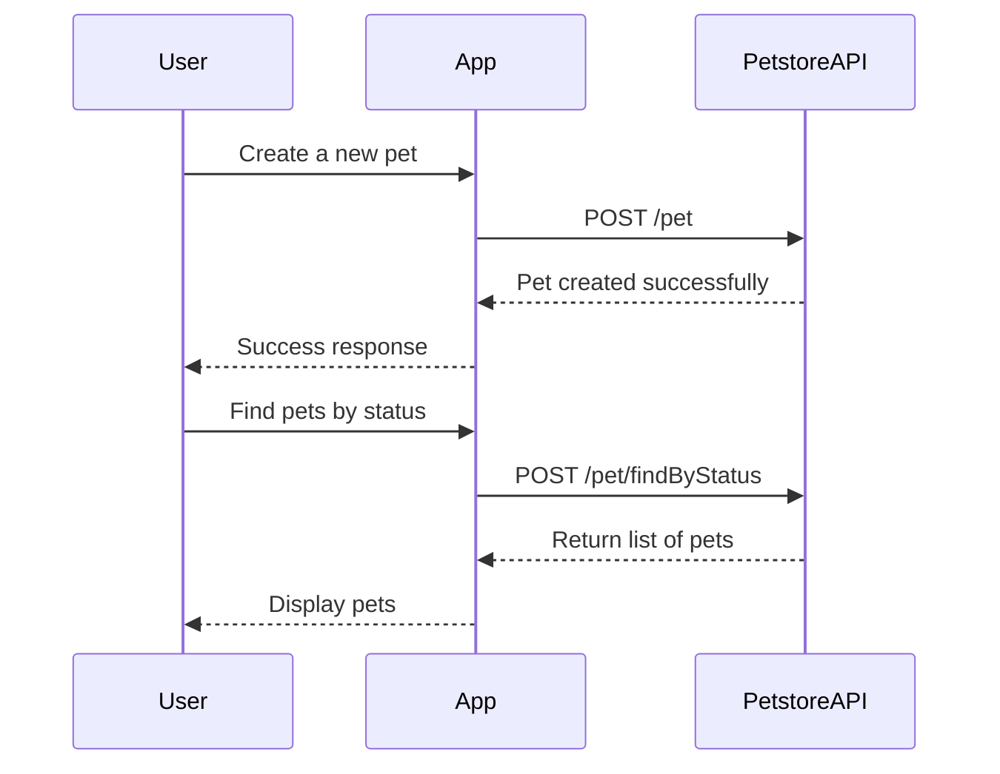

```markdown
# Final Functional Requirements for Petstore Application

## Overview
The Petstore application will provide an API for managing pets, orders, and users. It will adhere to RESTful principles, utilizing POST for external data retrieval and GET for application result retrieval.

## API Endpoints

### 1. Pet Management

#### 1.1 Add a New Pet
- **Endpoint**: `POST /pet`
- **Description**: Adds a new pet to the store.
- **Request Body**:
  ```json
  {
    "id": 0,
    "category": {
      "id": 0,
      "name": "string"
    },
    "name": "string",
    "photoUrls": [
      "string"
    ],
    "tags": [
      {
        "id": 0,
        "name": "string"
      }
    ],
    "status": "available"
  }
  ```
- **Response**:
  - **Status Code**: 200 OK
  - **Response Body**: Same as request body.

#### 1.2 Update an Existing Pet
- **Endpoint**: `PUT /pet`
- **Description**: Updates an existing pet's details.
- **Request Body**: Same as Add a New Pet.
- **Response**: Same as request body.

#### 1.3 Find Pets by Status
- **Endpoint**: `POST /pet/findByStatus`
- **Description**: Retrieves pets based on their status.
- **Request Body**:
  ```json
  {
    "status": ["available", "pending", "sold"]
  }
  ```
- **Response**:
  - **Status Code**: 200 OK
  - **Response Body**:
  ```json
  [
    {
      "id": 0,
      "name": "string",
      "status": "available"
    }
  ]
  ```

### 2. Order Management

#### 2.1 Place an Order for a Pet
- **Endpoint**: `POST /store/order`
- **Description**: Places a new order for a pet.
- **Request Body**:
  ```json
  {
    "id": 0,
    "petId": 0,
    "quantity": 0,
    "shipDate": "2025-03-11T18:17:25.852Z",
    "status": "placed",
    "complete": true
  }
  ```
- **Response**: Same as request body.

### 3. User Management

#### 3.1 Create a New User
- **Endpoint**: `POST /user`
- **Description**: Creates a new user in the system.
- **Request Body**:
  ```json
  {
    "id": 0,
    "username": "string",
    "firstName": "string",
    "lastName": "string",
    "email": "string",
    "password": "string",
    "phone": "string",
    "userStatus": 0
  }
  ```
- **Response**:
  - **Status Code**: 200 OK
  - **Response Body**:
  ```json
  {
    "id": 0,
    "username": "string",
    "firstName": "string",
    "lastName": "string",
    "email": "string"
  }
  ```

## User-App Interaction Diagram


```