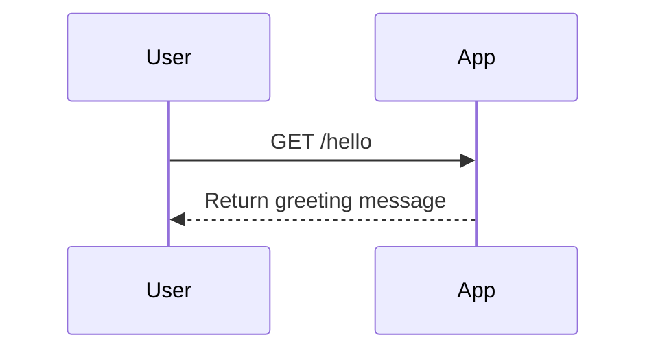

```markdown
# Functional Requirements for the Hello Endpoint

## API Endpoint

### 1. **GET /hello**
- **Description**: Retrieve a greeting message from the application.
- **Request Format**: No parameters required.
- **Response Format**:
  ```json
  {
      "status": "success",
      "data": {
          "message": "Hello, World!"
      }
  }
  ```

## User-App Interaction Diagram


```