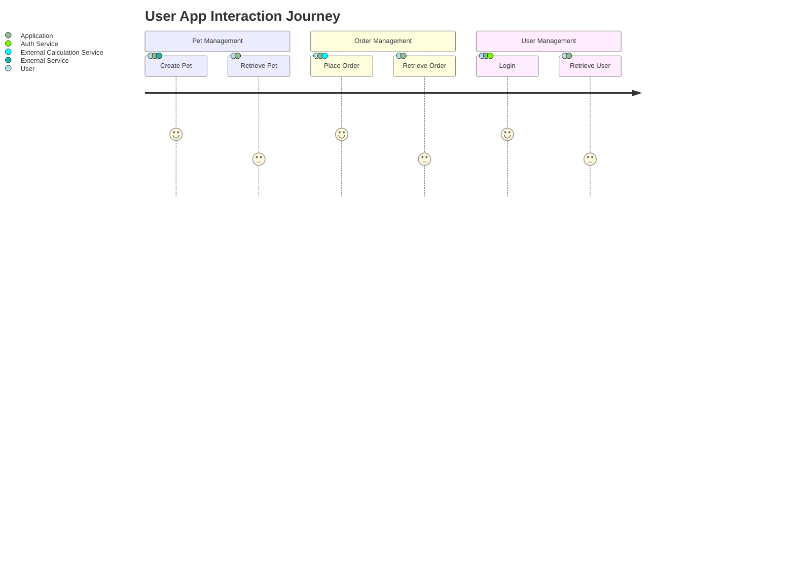
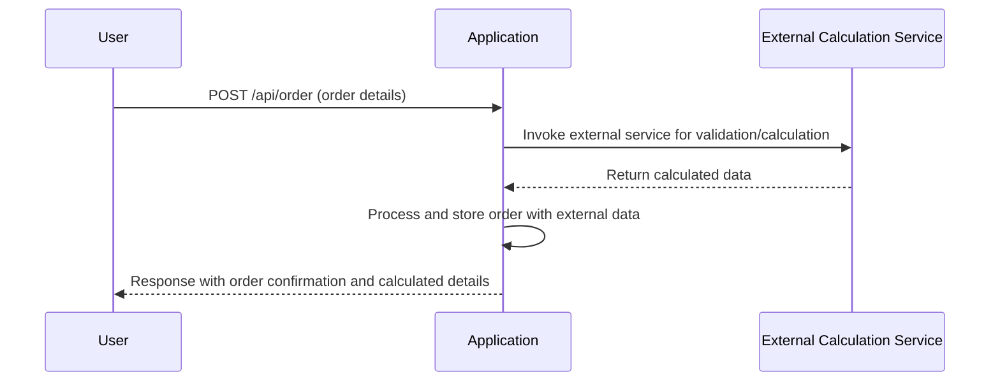

# Functional Requirements Document

## Overview
This document outlines the functional requirements for the backend application, which implements a RESTful API for managing pets, orders, and users. The application adheres to RESTful principles, ensuring that all external business logic is invoked via POST endpoints, while GET endpoints are used solely for retrieving stored application results.

## API Endpoints

### 1. Pet Management

#### 1.1 Create Pet (POST)
- **Endpoint:** `/api/pet`
- **Description:** Accepts pet data, triggers any business logic or external data retrieval necessary, and stores the pet record.
- **Request Format (JSON):**
    ```json
    {
      "name": "string",
      "category": "string",
      "photoUrls": ["string"],
      "tags": ["string"],
      "status": "available | pending | sold"
    }
    ```
- **Response Format (JSON):**
    ```json
    {
      "id": "numeric",
      "name": "string",
      "category": "string",
      "photoUrls": ["string"],
      "tags": ["string"],
      "status": "available | pending | sold",
      "externalData": { ... } // Any additional external information if applicable.
    }
    ```

#### 1.2 Retrieve Pet (GET)
- **Endpoint:** `/api/pet/{petId}`
- **Description:** Retrieves pet details stored in the application.
- **Response Format (JSON):**
    ```json
    {
      "id": "numeric",
      "name": "string",
      "category": "string",
      "photoUrls": ["string"],
      "tags": ["string"],
      "status": "available | pending | sold"
    }
    ```

### 2. Order Management

#### 2.1 Place Order (POST)
- **Endpoint:** `/api/order`
- **Description:** Accepts order details, performs necessary external checks (e.g., stock availability, pricing calculations), and stores the order.
- **Request Format (JSON):**
    ```json
    {
      "petId": "numeric",
      "quantity": "integer",
      "shipDate": "ISO 8601 date string",
      "status": "placed | approved | delivered",
      "complete": "boolean"
    }
    ```
- **Response Format (JSON):**
    ```json
    {
      "orderId": "numeric",
      "petId": "numeric",
      "quantity": "integer",
      "shipDate": "ISO 8601 date string",
      "status": "placed | approved | delivered",
      "complete": "boolean",
      "externalCalculation": { ... } // Calculated data from an external source.
    }
    ```

#### 2.2 Retrieve Order (GET)
- **Endpoint:** `/api/order/{orderId}`
- **Description:** Retrieves stored order details.
- **Response Format (JSON):**
    ```json
    {
      "orderId": "numeric",
      "petId": "numeric",
      "quantity": "integer",
      "shipDate": "ISO 8601 date string",
      "status": "placed | approved | delivered",
      "complete": "boolean"
    }
    ```

### 3. User Management

#### 3.1 User Login (POST)
- **Endpoint:** `/api/user/login`
- **Description:** Accepts user credentials, performs external authentication processes, and generates a session token.
- **Request Format (JSON):**
    ```json
    {
      "username": "string",
      "password": "string"
    }
    ```
- **Response Format (JSON):**
    ```json
    {
      "username": "string",
      "token": "string",
      "expiresAt": "ISO 8601 date string"
    }
    ```

#### 3.2 Retrieve User (GET)
- **Endpoint:** `/api/user/{username}`
- **Description:** Retrieves stored user data.
- **Response Format (JSON):**
    ```json
    {
      "id": "numeric",
      "username": "string",
      "firstName": "string",
      "lastName": "string",
      "email": "string",
      "phone": "string",
      "userStatus": "numeric"
    }
    ```

## User Interaction Diagrams

### User Journey Diagram



### Sequence Diagram for Order Placement



This document provides a clear and structured outline of the functional requirements for the application, ensuring all necessary API endpoints and interactions are defined.