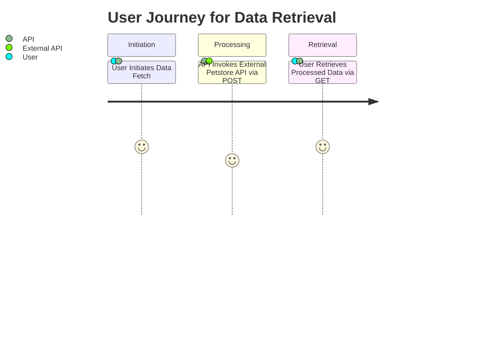
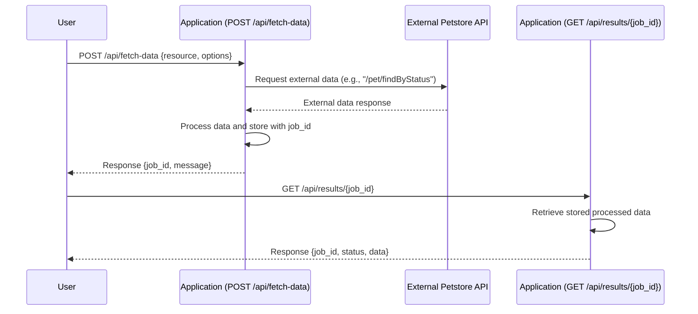

# Functional Requirements

## API Endpoints

### 1. POST /api/fetch-data
- **Purpose:**  
  Invoke business logic to fetch data from the external Petstore API and perform any necessary calculations before storing or processing the results.

- **Request Format:**  
  **Content-Type:** application/json  
  **Example Request Body:**
  ```json
  {
    "resource": "pet", 
    "options": {
      "status": ["available", "pending", "sold"]
    }
  }
  ```
  - **resource:** Specifies which data category to fetch. Supported values include "pet", "store", "user".
  - **options:** Additional filters or parameters for the external API call.

- **Response Format:**  
  **Content-Type:** application/json  
  **Example Response Body:**
  ```json
  {
    "job_id": "123e4567-e89b-12d3-a456-426614174000",
    "message": "Data retrieval initiated and processing in progress."
  }
  ```

### 2. GET /api/results/{job_id}
- **Purpose:**  
  Retrieve processed results/data from prior POST calls.

- **Request Parameters:**  
  - **Path Parameter:** job_id (string) – Identifier returned from POST /api/fetch-data.

- **Response Format:**  
  **Content-Type:** application/json  
  **Example Response Body:**
  ```json
  {
    "job_id": "123e4567-e89b-12d3-a456-426614174000",
    "status": "completed",
    "data": [
      {
        "id": 1,
        "name": "doggie",
        "status": "available",
        "photoUrls": ["https://example.com/dog1.jpg"]
      }
    ]
  }
  ```

## Business Logic
- All external data retrieval and computations (calculations, filtering, and processing) are executed within the POST endpoint.
- The POST /api/fetch-data endpoint manages the external call to the Petstore API, processes the data, and stores or caches the results using a unique job_id.
- The GET /api/results/{job_id} endpoint is solely for retrieving the processed results as generated by previous POST requests, ensuring separation between external data fetching and internal data retrieval.

## User-App Interaction Diagrams

### Journey Diagram


### Sequence Diagram
