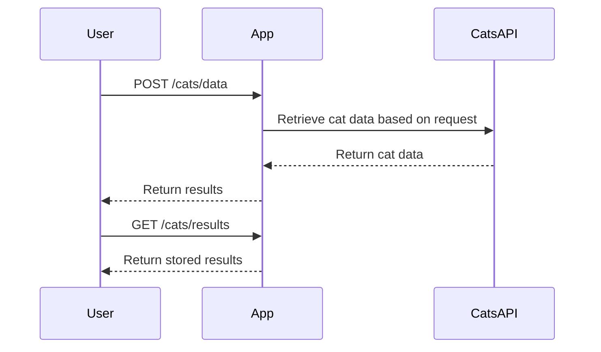

```markdown
# Functional Requirements for Cats API Application

## API Endpoints

### 1. POST /cats/data
- **Description**: Retrieves data from the Cats API based on user input.
- **Request Format**:
  ```json
  {
    "breed": "Siamese",
    "limit": 5
  }
  ```
- **Response Format**:
  ```json
  {
    "status": "success",
    "data": [
      {
        "id": "abc123",
        "name": "Fluffy",
        "image": "http://example.com/image1.jpg"
      },
      {
        "id": "def456",
        "name": "Whiskers",
        "image": "http://example.com/image2.jpg"
      }
    ]
  }
  ```

### 2. GET /cats/results
- **Description**: Retrieves results from the previous data retrieval request.
- **Response Format**:
  ```json
  {
    "status": "success",
    "results": [
      {
        "id": "abc123",
        "name": "Fluffy",
        "image": "http://example.com/image1.jpg"
      },
      {
        "id": "def456",
        "name": "Whiskers",
        "image": "http://example.com/image2.jpg"
      }
    ]
  }
  ```

## User-App Interaction


```