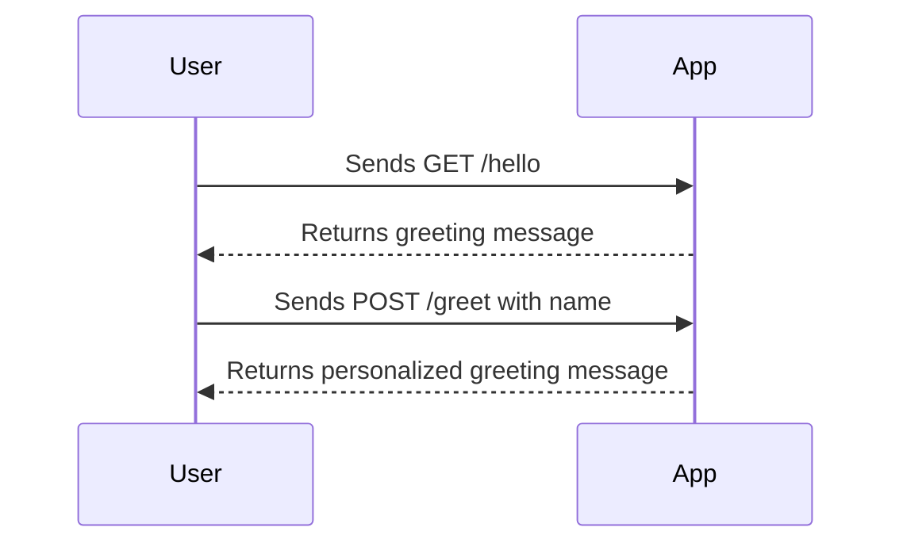
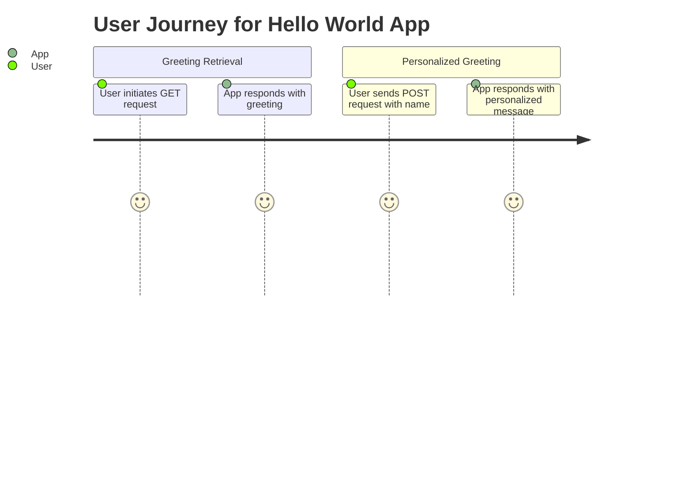

```markdown
# Functional Requirements for Hello World App

## API Endpoints

### 1. GET /hello
- **Description**: Retrieve a simple greeting message.
- **Request Format**: 
  - Method: GET
  - URL: `/hello`
  
- **Response Format**:
  - Status Code: 200 OK
  - Body: 
    ```json
    {
      "message": "Hello, World!"
    }
    ```

### 2. POST /greet
- **Description**: Accept a name and return a personalized greeting message.
- **Request Format**:
  - Method: POST
  - URL: `/greet`
  - Body:
    ```json
    {
      "name": "string"
    }
    ```

- **Response Format**:
  - Status Code: 200 OK
  - Body:
    ```json
    {
      "message": "Hello, {name}!"
    }
    ```

## User-App Interaction Diagram



## Journey Diagram


```