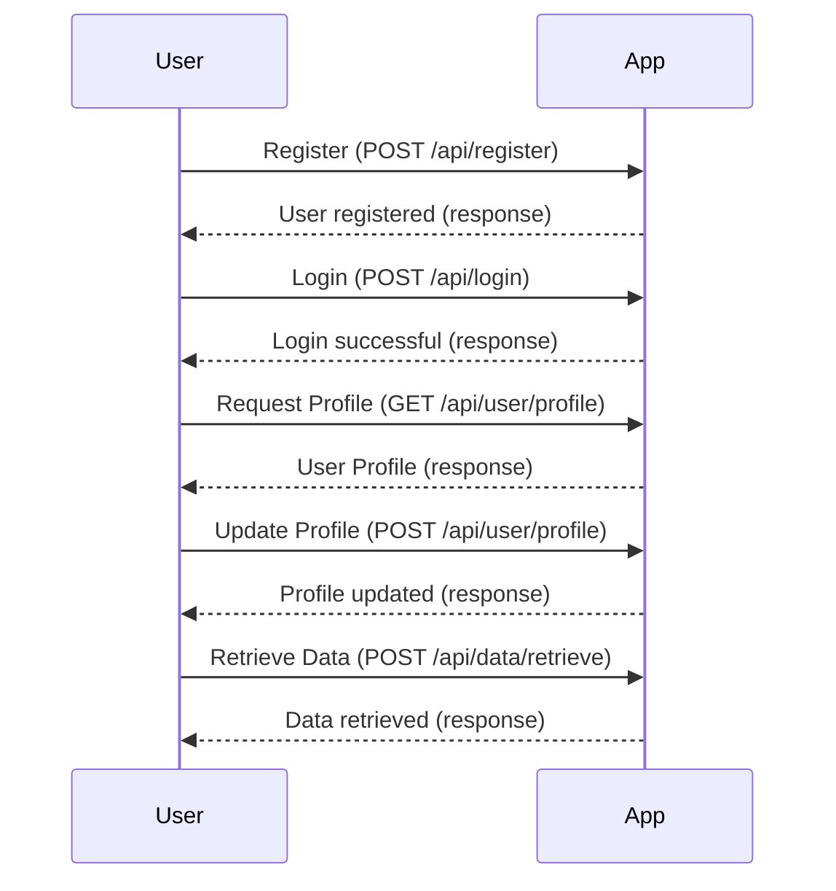
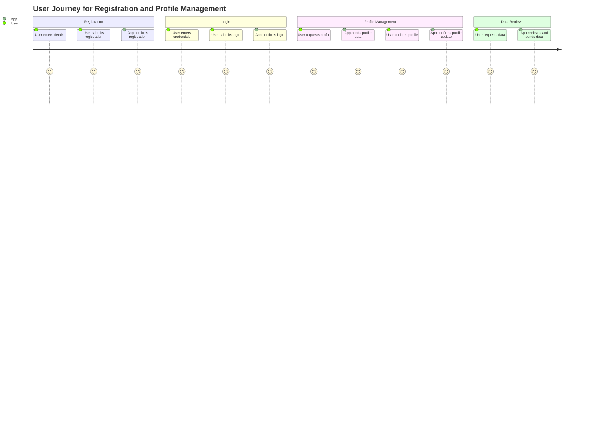

```markdown
# Functional Requirements Document

## API Endpoints

### 1. User Registration
- **Endpoint**: `POST /api/register`
- **Request Format**:
  ```json
  {
    "username": "string",
    "password": "string",
    "email": "string"
  }
  ```
- **Response Format**:
  ```json
  {
    "message": "User registered successfully.",
    "userId": "string"
  }
  ```

### 2. User Login
- **Endpoint**: `POST /api/login`
- **Request Format**:
  ```json
  {
    "username": "string",
    "password": "string"
  }
  ```
- **Response Format**:
  ```json
  {
    "message": "Login successful.",
    "token": "string"
  }
  ```

### 3. Retrieve User Profile
- **Endpoint**: `GET /api/user/profile`
- **Request Format**: (Authorization required via Bearer token)
  - Headers: `Authorization: Bearer <token>`
- **Response Format**:
  ```json
  {
    "userId": "string",
    "username": "string",
    "email": "string"
  }
  ```

### 4. Update User Profile
- **Endpoint**: `POST /api/user/profile`
- **Request Format**:
  ```json
  {
    "username": "string",
    "email": "string"
  }
  ```
- **Response Format**:
  ```json
  {
    "message": "Profile updated successfully."
  }
  ```

### 5. Data Retrieval
- **Endpoint**: `POST /api/data/retrieve`
- **Request Format**:
  ```json
  {
    "query": "string"
  }
  ```
- **Response Format**:
  ```json
  {
    "data": [
      {
        "id": "string",
        "value": "string"
      }
    ]
  }
  ```

## User-App Interaction Diagram



## User Journey Diagram


```