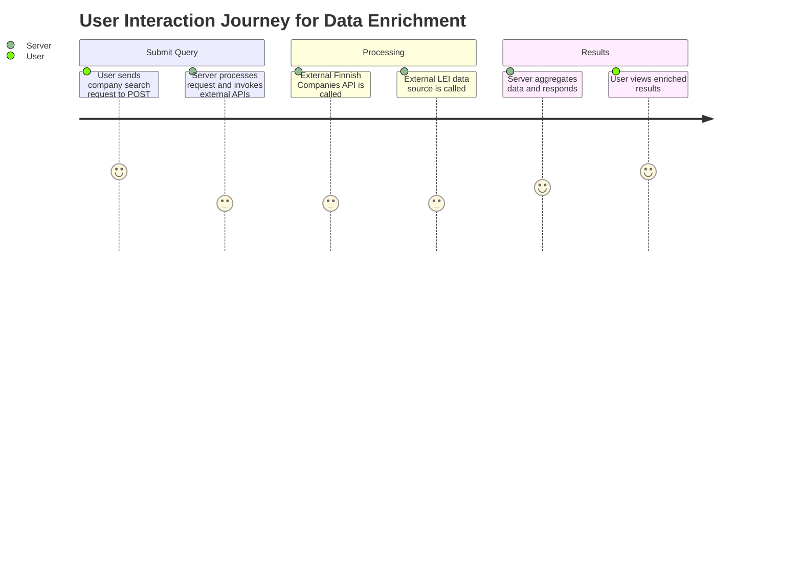
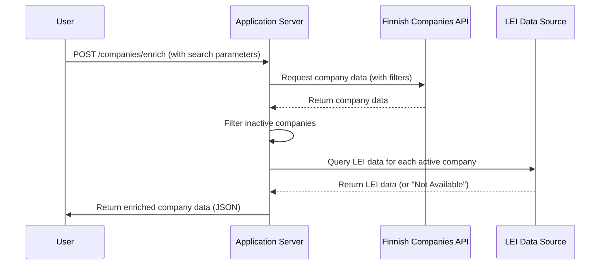

# Functional Requirements Specification for Finnish Companies Data Retrieval and Enrichment Application

## 1. Overview
This application retrieves and enriches data from the Finnish Companies Registry based on user-provided company names, filtering out inactive entities and obtaining Legal Entity Identifiers (LEI) where available.

## 2. API Endpoints

### 2.1 POST /companies/enrich
- **Purpose**: Invokes external data sources, processes business logic, and returns enriched company data.

- **Request**:
  - **URL**: `/companies/enrich`
  - **Method**: `POST`
  - **Content-Type**: `application/json`
  - **Request Body Example**:
    ```json
    {
      "companyName": "Tech",
      "registrationDateStart": "2020-01-01",
      "registrationDateEnd": "2021-12-31"
    }
    ```
  - **Description**: Accepts a company name or partial name and optional filters for registration dates.

- **Response**:
  - **HTTP Status**: `200 OK`
  - **Content-Type**: `application/json`
  - **Response Body Example**:
    ```json
    {
      "companies": [
        {
          "companyName": "Tech Innovations",
          "businessId": "1234567-8",
          "companyType": "OY",
          "registrationDate": "2020-05-10",
          "status": "Active",
          "LEI": "5493001KJTIIGC8Y1R12"
        },
        {
          "companyName": "Tech Solutions",
          "businessId": "9876543-2",
          "companyType": "OY",
          "registrationDate": "2021-03-15",
          "status": "Active",
          "LEI": "Not Available"
        }
      ]
    }
    ```
  - **Description**: Returns a structured list of active companies matching the search criteria, enriched with LEI data where applicable.

### 2.2 GET /companies/results/{jobId}
- **Purpose**: Retrieves results of previously processed enrichment jobs.

- **Request**:
  - **URL**: `/companies/results/{jobId}`
  - **Method**: `GET`
  - **Description**: Allows users to fetch results of a specific enrichment job using a unique job identifier.

- **Response**:
  - **HTTP Status**: `200 OK`
  - **Content-Type**: `application/json`
  - **Response Body Example**:
    ```json
    {
      "jobId": "abc123",
      "status": "Completed",
      "companies": [
        {
          "companyName": "Tech Innovations",
          "businessId": "1234567-8",
          "companyType": "OY",
          "registrationDate": "2020-05-10",
          "status": "Active",
          "LEI": "5493001KJTIIGC8Y1R12"
        }
      ]
    }
    ```
  - **Description**: Returns the status and results of a previously initiated enrichment job.

## 3. Business Logic Overview
- The application processes requests through the POST endpoint, invoking the Finnish Companies Registry API and LEI data sources.
- It filters out inactive companies and aggregates results before responding with structured data.

## 4. User-App Interaction Flow

### 4.1 Journey Diagram


### 4.2 Sequence Diagram


This document specifies the functional requirements, including API endpoints, request/response formats, and user-app interaction flows, ensuring clarity for implementation.