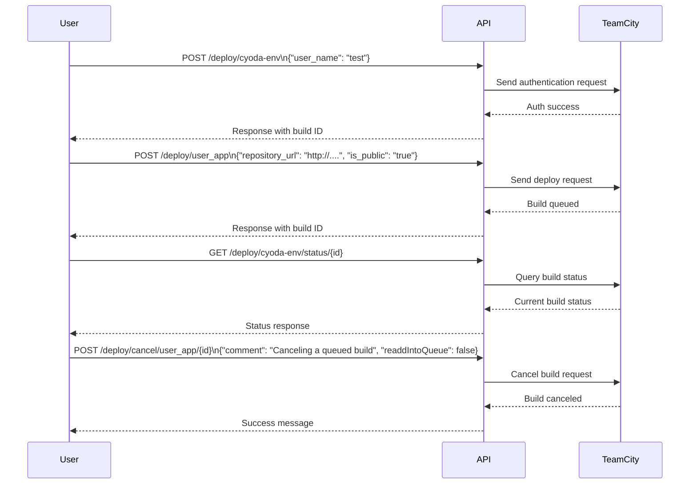

To develop functional requirements for your application, we will structure them as user stories and use cases. Each requirement will include the necessary API endpoints along with details on the request and response formats. We will also prepare Mermaid diagrams to visualize user-app interactions.

### User Stories

1. **User Authentication**
   - **As a** user,
   - **I want to** authenticate using a Bearer token,
   - **So that** I can access the deployment environment.

   **API Endpoint:**
   - `POST /deploy/cyoda-env`
     - **Request Body:**
       ```json
       {
         "user_name": "test"
       }
       ```
     - **Response:**
       ```json
       {
         "build_id": "12345"
       }
       ```

2. **Deploy User Application**
   - **As a** user,
   - **I want to** deploy my application, 
   - **So that** it can be available for use.

   **API Endpoint:**
   - `POST /deploy/user_app`
     - **Request Body:**
       ```json
       {
         "repository_url": "http://....",
         "is_public": "true"
       }
       ```
     - **Response:**
       ```json
       {
         "build_id": "67890"
       }
       ```

3. **Check Deployment Status**
   - **As a** user,
   - **I want to** check the status of my deployment,
   - **So that** I can know if it’s completed or still running.

   **API Endpoint:**
   - `GET /deploy/cyoda-env/status/{id}`
     - **Request Parameters:** `id`
     - **Response:**
       ```json
       {
         "status": "running/completed",
         "repository_url": "http://....",
         "is_public": "true"
       }
       ```

4. **Retrieve Deployment Statistics**
   - **As a** user,
   - **I want to** get statistics for my deployment,
   - **So that** I can analyze performance and resource usage.

   **API Endpoint:**
   - `GET /deploy/cyoda-env/statistics/{id}`
     - **Request Parameters:** `id`
     - **Response:**
       ```json
       {
         "statistics": {
             "metric1": "value",
             "metric2": "value"
         },
         "repository_url": "http://....",
         "is_public": "true"
       }
       ```

5. **Cancel User Application Deployment**
   - **As a** user,
   - **I want to** cancel my deployment if it is still queued,
   - **So that** I can manage resources effectively.

   **API Endpoint:**
   - `POST /deploy/cancel/user_app/{id}`
     - **Request Parameters:** `id`
     - **Request Body:**
       ```json
       {
         "comment": "Canceling a queued build",
         "readdIntoQueue": false
       }
       ```
     - **Response:**
       ```json
       {
         "message": "Build canceled successfully"
       }
       ```

### Use Cases

#### Use Case 1: User Login and Token Generation
- **Actors:** User
- **Pre-condition:** User needs to have valid credentials.
- **Flow:**
  1. User sends login request.
  2. App validates credentials and returns a Bearer token.

#### Use Case 2: Application Deployment
- **Actors:** User
- **Pre-condition:** User should be authenticated.
- **Flow:**
  1. User sends deployment request (including repository URL and visibility).
  2. App enqueues the build and returns the build ID.

#### Use Case 3: Monitor Deployment Status
- **Actors:** User
- **Pre-condition:** User must have a build ID.
- **Flow:**
  1. User requests status for a specific build ID.
  2. App retrieves and returns the current status.

#### Use Case 4: View Deployment Statistics
- **Actors:** User
- **Pre-condition:** User must have a build ID.
- **Flow:**
  1. User requests statistics for a specific build ID.
  2. App gathers and sends statistics data.

#### Use Case 5: Cancel Deployment
- **Actors:** User
- **Pre-condition:** User must have a build ID of a queued build.
- **Flow:**
  1. User sends cancel request with the build ID.
  2. App cancels the build and confirms the action.

### Mermaid Diagrams

Here are the basic UML activity diagrams represented with Mermaid syntax to illustrate user-app interactions:


```mermaid
sequenceDiagram
    participant User
    participant API
    participant TeamCity

    User->>API: POST /deploy/cyoda-env\n{"user_name": "test"}
    API->>TeamCity: Send authentication request
    TeamCity-->>API: Auth success
    API-->>User: Response with build ID

    User->>API: POST /deploy/user_app\n{"repository_url": "http://....", "is_public": "true"}
    API->>TeamCity: Send deploy request
    TeamCity-->>API: Build queued
    API-->>User: Response with build ID

    User->>API: GET /deploy/cyoda-env/status/{id}
    API->>TeamCity: Query build status
    TeamCity-->>API: Current build status
    API-->>User: Status response

    User->>API: POST /deploy/cancel/user_app/{id}\n{"comment": "Canceling a queued build", "readdIntoQueue": false}
    API->>TeamCity: Cancel build request
    TeamCity-->>API: Build canceled
    API-->>User: Success message
```

### Conclusion

This structured approach outlines the functional requirements for your deployment management application. The user stories and use cases ensure clarity in functionality while the API details provide a clear blueprint for development. The Mermaid diagrams visualize the interaction, contributing to better understanding and communication among team members.