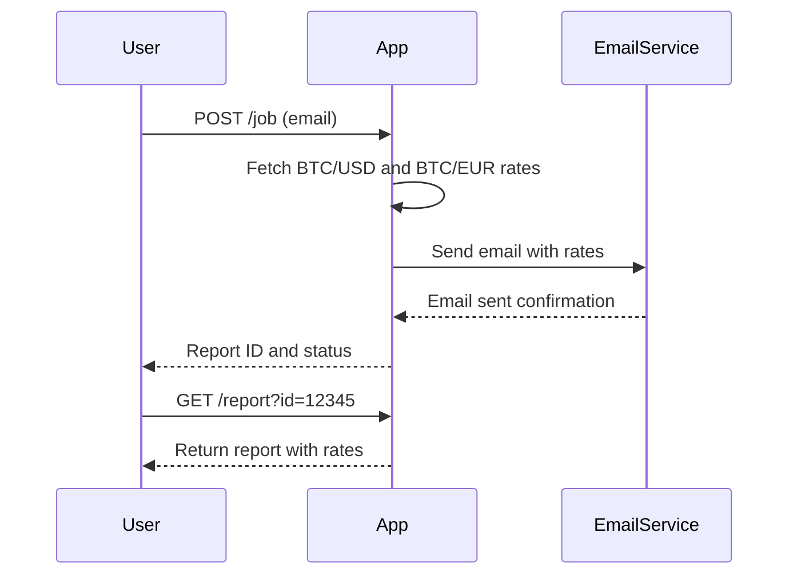

Here are the final functional requirements formatted clearly:

### Functional Requirements

#### User Stories

1. **Report Creation Initiation**
   - **User Story**: As a user, I want to initiate a report creation process so that I can receive the latest Bitcoin conversion rates.
   - **Endpoint**: `POST /job`
   - **Request Format**: 
     ```json
     {
       "email": "user@example.com"
     }
     ```
   - **Response Format**: 
     ```json
     {
       "report_id": "12345",
       "status": "Report is being generated."
     }
     ```

2. **Retrieve Report by ID**
   - **User Story**: As a user, I want to retrieve my report by its ID so that I can view the conversion rates.
   - **Endpoint**: `GET /report`
   - **Request Format**: 
     ```
     GET /report?id=12345
     ```
   - **Response Format**: 
     ```json
     {
       "report_id": "12345",
       "btc_usd_rate": "X.XX",
       "btc_eur_rate": "Y.YY",
       "timestamp": "2023-10-01T12:00:00Z"
     }
     ```

#### API Endpoints Summary

| Method | Endpoint  | Request Format                   | Response Format                                      |
|--------|-----------|----------------------------------|-----------------------------------------------------|
| POST   | /job      | `{ "email": "user@example.com" }` | `{ "report_id": "12345", "status": "Report is being generated." }` |
| GET    | /report   | `GET /report?id=12345`          | `{ "report_id": "12345", "btc_usd_rate": "X.XX", "btc_eur_rate": "Y.YY", "timestamp": "2023-10-01T12:00:00Z" }` |

#### User-App Interaction Diagram


```mermaid
sequenceDiagram
    participant User
    participant App
    participant EmailService

    User->>App: POST /job (email)
    App->>App: Fetch BTC/USD and BTC/EUR rates
    App->>EmailService: Send email with rates
    EmailService-->>App: Email sent confirmation
    App-->>User: Report ID and status

    User->>App: GET /report?id=12345
    App-->>User: Return report with rates
```

This document provides a comprehensive overview of the functional requirements for your application, outlining user stories, API endpoints, and user-app interactions. Adjust any details based on specific use cases or additional requirements you may have.