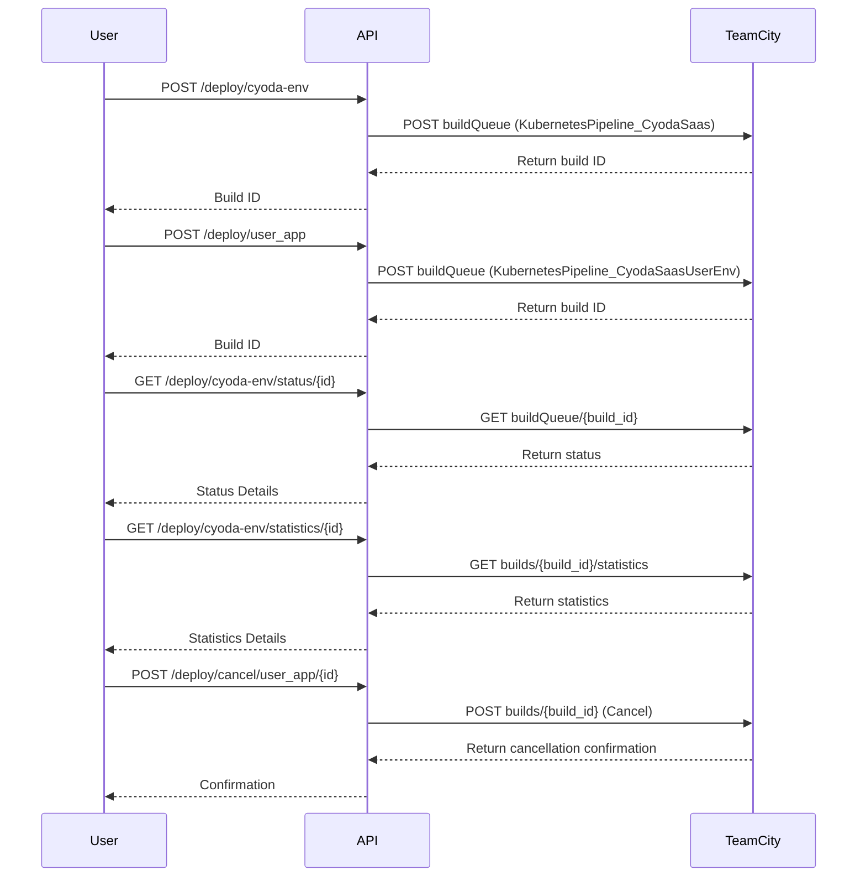

Below are the functional requirements for your deployment and environment configuration management application, structured as user stories and use cases. Each user story includes the relevant API endpoints, request/response formats, and Mermaid diagrams to visualize user-app interactions.

---

### User Stories and Use Cases

#### User Story 1: User Authentication
**As a** user,   
**I want** to authenticate using a Bearer token,  
**So that** I can access the deployment and environment management functionalities.

**Use Case: Authenticate User**  
- **API Endpoint:** `POST /deploy/cyoda-env`  
- **Request Format:**
    ```json
    {
        "user_name": "test"
    }
    ```
- **Response Format:**
   - **Status 200:** Authentication successful, return build ID.
   - **Status 401:** Unauthorized, invalid token.

---

#### User Story 2: Deploying a Cyoda Environment
**As a** user,  
**I want** to initiate the deployment of a cyoda environment,  
**So that** I can manage the configuration for my project.

**Use Case: Deploy Cyoda Environment**  
- **API Endpoint:** `POST /deploy/cyoda-env`  
- **Request Format:**
    ```json
    {
        "user_name": "test"
    }
    ```
- **Action:** 
    - `POST https://teamcity.cyoda.org/app/rest/buildQueue` with payload:
        ```json
        {
            "buildType": {
                "id": "KubernetesPipeline_CyodaSaas"
            },
            "properties": {
                "property": [
                    {
                        "name": "user_defined_keyspace",
                        "value": "test"
                    },
                    {
                        "name": "user_defined_namespace",
                        "value": "test"
                    }
                ]
            }
        }
        ```
- **Response Format:**
    - **Status 200:** Return build ID.
    - **Status 400:** Bad request, invalid parameters.

---

#### User Story 3: Deploying a User Application
**As a** user,  
**I want** to deploy my application from a repository,  
**So that** I can utilize my configurations.

**Use Case: Deploy User Application**  
- **API Endpoint:** `POST /deploy/user_app`  
- **Request Format:**
    ```json
    {
        "repository_url": "http://....",
        "is_public": "true"
    }
    ```
- **Action:** 
    - `POST https://teamcity.cyoda.org/app/rest/buildQueue` with payload:
        ```json
        {
            "buildType": {
                "id": "KubernetesPipeline_CyodaSaasUserEnv"
            },
            "properties": {
                "property": [
                    {
                        "name": "user_defined_keyspace",
                        "value": "test"
                    },
                    {
                        "name": "user_defined_namespace",
                        "value": "test"
                    }
                ]
            }
        }
        ```
- **Response Format:**
    - **Status 200:** Return build ID.
    - **Status 400:** Bad request, invalid parameters.

---

#### User Story 4: Check Deployment Status
**As a** user,  
**I want** to check the status of my deployments,  
**So that** I can monitor progress and outcomes.

**Use Case: Get Deployment Status**  
- **API Endpoint:** `GET /deploy/cyoda-env/status/{id}`  
- **Action:** 
    - `GET https://teamcity.cyoda.org/app/rest/buildQueue/id:{build_id}`
- **Response Format:**
    - **Status 200:** Return status details.
    - **Status 404:** Not found, invalid ID.

---

#### User Story 5: Get Deployment Statistics
**As a** user,  
**I want** to retrieve statistics of my deployments,  
**So that** I can analyze performance.

**Use Case: Get Deployment Statistics**  
- **API Endpoint:** `GET /deploy/cyoda-env/statistics/{id}`  
- **Action:** 
    - `GET https://teamcity.cyoda.org/app/rest/builds/id:{build_id}/statistics`
- **Response Format:**
    - **Status 200:** Return statistics details.
    - **Status 404:** Not found, invalid ID.

---

#### User Story 6: Cancel a User Application Deployment
**As a** user,  
**I want** to cancel my application deployment,  
**So that** I can stop ongoing or queued processes.

**Use Case: Cancel User Application Deployment**  
- **API Endpoint:** `POST /deploy/cancel/user_app/{id}`  
- **Request Format:**
    ```json
    {
        "comment": "Canceling a queued build",
        "readdIntoQueue": false
    }
    ```
- **Action:** 
    - `POST https://teamcity.cyoda.org/app/rest/builds/id:{build_id}`
- **Response Format:**
    - **Status 200:** Return confirmation of cancellation.
    - **Status 404:** Not found, invalid ID.

---

### Visual Representation Using Mermaid


```mermaid
sequenceDiagram
    participant User
    participant API
    participant TeamCity

    User->>API: POST /deploy/cyoda-env
    API->>TeamCity: POST buildQueue (KubernetesPipeline_CyodaSaas)
    TeamCity-->>API: Return build ID
    API-->>User: Build ID

    User->>API: POST /deploy/user_app
    API->>TeamCity: POST buildQueue (KubernetesPipeline_CyodaSaasUserEnv)
    TeamCity-->>API: Return build ID
    API-->>User: Build ID

    User->>API: GET /deploy/cyoda-env/status/{id}
    API->>TeamCity: GET buildQueue/{build_id}
    TeamCity-->>API: Return status
    API-->>User: Status Details

    User->>API: GET /deploy/cyoda-env/statistics/{id}
    API->>TeamCity: GET builds/{build_id}/statistics
    TeamCity-->>API: Return statistics
    API-->>User: Statistics Details

    User->>API: POST /deploy/cancel/user_app/{id}
    API->>TeamCity: POST builds/{build_id} (Cancel)
    TeamCity-->>API: Return cancellation confirmation
    API-->>User: Confirmation
```

---

These functional requirements provide a clear guideline to implement the backend application and ensure each functionality is well-defined for further development. Please let me know if you need any adjustments or further clarifications on any section!