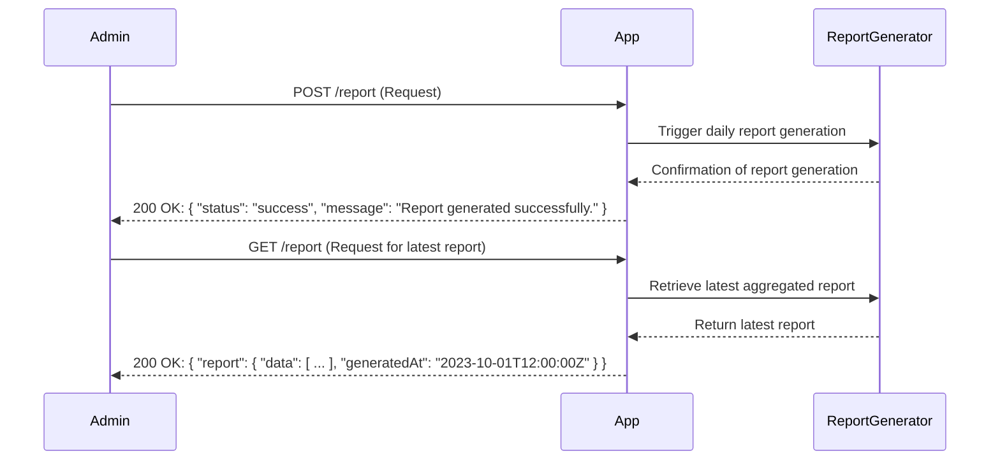

Here's the final formatted functional requirements document based on the user stories and use cases provided.

### Functional Requirements Document

#### User Story 1: Generate Daily Report
- **As an admin,** I want to generate a daily report so that I can review aggregated data.

**Use Case: Generate Daily Report**
- **API Endpoint:** `POST /report`
- **Request Format:** (Payload can be empty as this is a scheduled job)
  ```json
  {}
  ```
- **Response Format:**
  - **Status 200:**
    ```json
    {
      "status": "success",
      "message": "Report generated successfully."
    }
    ```
  - **Status 500:**
    ```json
    {
      "status": "error",
      "message": "Error generating report."
    }
    ```

#### User Story 2: Fetch Latest Report
- **As an admin,** I want to retrieve the latest aggregated report so that I can quickly review it.

**Use Case: Fetch Latest Report**
- **API Endpoint:** `GET /report`
- **Request Format:** (No request body)
  - **Response Format:**
  - **Status 200:**
    ```json
    {
      "report": {
        "data": [ /* aggregated data */ ],
        "generatedAt": "2023-10-01T12:00:00Z"
      }
    }
    ```
  - **Status 404:**
    ```json
    {
      "status": "error",
      "message": "No report available."
    }
    ```

### Visual Representation
Below is a Mermaid diagram representing user-app interaction for the functional requirements.


```mermaid
sequenceDiagram
    participant Admin
    participant App
    participant ReportGenerator

    Admin->>App: POST /report (Request)
    App->>ReportGenerator: Trigger daily report generation
    ReportGenerator-->>App: Confirmation of report generation
    App-->>Admin: 200 OK: { "status": "success", "message": "Report generated successfully." }

    Admin->>App: GET /report (Request for latest report)
    App->>ReportGenerator: Retrieve latest aggregated report
    ReportGenerator-->>App: Return latest report
    App-->>Admin: 200 OK: { "report": { "data": [ ... ], "generatedAt": "2023-10-01T12:00:00Z" } }
```

This document outlines your functional requirements, including user stories, use cases, associated API endpoints, request/response formats, and a visual representation of interactions. Let me know if you need any further modifications or additions!