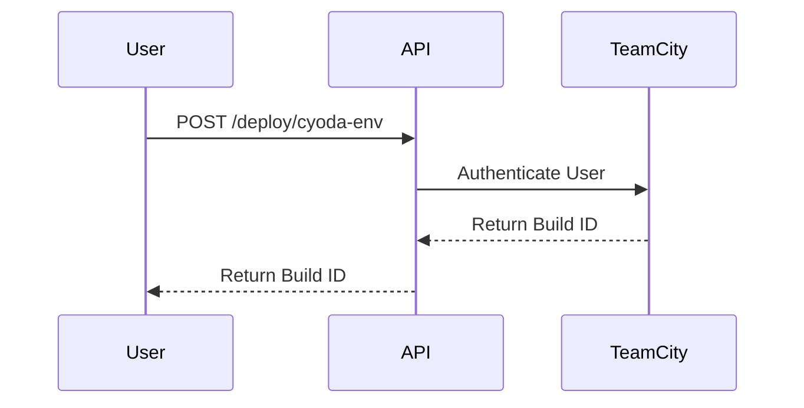
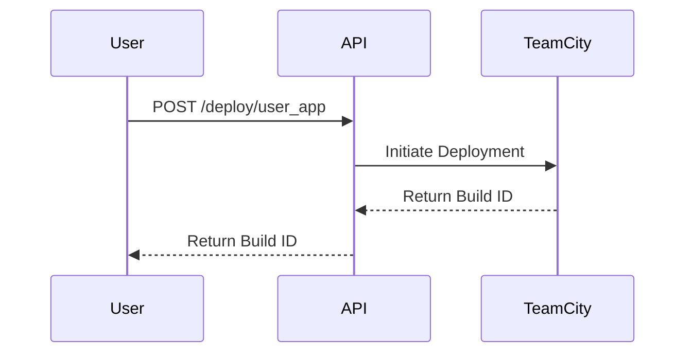
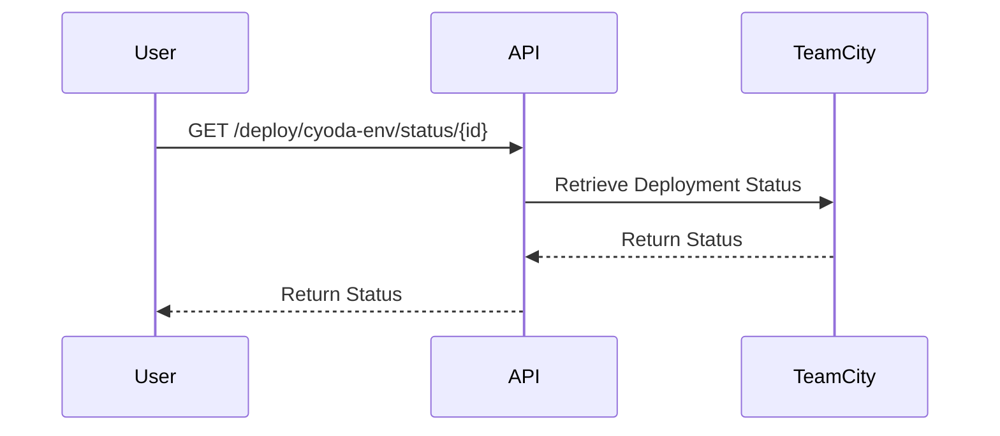
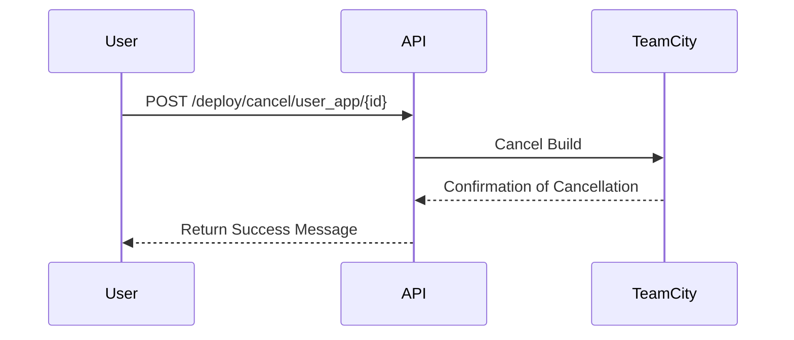

Here are the functional requirements for your application, structured as user stories and use cases. Each user story includes necessary API endpoints, request and response formats, as well as illustrative diagrams using Mermaid syntax.

### User Stories

1. **User Authentication**
   - **As a** user,
   - **I want to** authenticate myself using a Bearer token,
   - **So that** I can access the application securely.

   #### API Endpoint:
   - **POST /deploy/cyoda-env**
     - **Request:**
       ```json
       {
           "user_name": "test"
       }
       ```
     - **Response:**
       ```json
       {
           "build_id": "12345"
       }
       ```

2. **Deploy Environment Configuration**
   - **As a** user,
   - **I want to** initiate a deployment for a specific environment,
   - **So that** my application can be configured for my user-defined environment.

   #### API Endpoint:
   - **POST /deploy/user_app**
     - **Request:**
       ```json
       {
           "repository_url": "http://example.com/repo",
           "is_public": "true"
       }
       ```
     - **Response:**
       ```json
       {
           "build_id": "67890"
       }
       ```

3. **Check Deployment Status**
   - **As a** user,
   - **I want to** check the status of my deployments,
   - **So that** I can monitor progress.

   #### API Endpoint:
   - **GET /deploy/cyoda-env/status/{id}**
     - **Response:**
       ```json
       {
           "status": "in-progress|completed|failed",
           "repository_url": "http://example.com/repo",
           "is_public": "true"
       }
       ```

4. **Get Deployment Statistics**
   - **As a** user,
   - **I want to** retrieve statistics for my deployment,
   - **So that** I can analyze the deployment.

   #### API Endpoint:
   - **GET /deploy/cyoda-env/statistics/{id}**
     - **Response:**
       ```json
       {
           "statistics": {
               "success": 10,
               "failure": 2,
               "duration": "5m"
           },
           "repository_url": "http://example.com/repo",
           "is_public": "true"
       }
       ```

5. **Cancel Deployment**
   - **As a** user,
   - **I want to** cancel a queued deployment,
   - **So that** I can halt unnecessary resource consumption.

   #### API Endpoint:
   - **POST /deploy/cancel/user_app/{id}**
     - **Request:**
       ```json
       {
           "comment": "Canceling a queued build",
           "readdIntoQueue": false
       }
       ```
     - **Response:**
       ```json
       {
           "status": "success",
           "message": "Build canceled"
       }
       ```

### Use Cases

1. **Use Case: User Authenticating**
   - **Actor:** User
   - **Precondition:** User has valid credentials.
   - **Main Flow:**
     1. User sends a POST request to `/deploy/cyoda-env` with username.
     2. System validates the token and returns the build ID.
   - **Postcondition:** User is authenticated, and session is established.

2. **Use Case: Deploy User Application**
   - **Actor:** User
   - **Precondition:** User is authenticated.
   - **Main Flow:**
     1. User sends a POST request to `/deploy/user_app` with repo details.
     2. System initiates deployment and returns build ID.
   - **Postcondition:** Deployment is initiated, and user receives build ID.

3. **Use Case: Check Deployment Status**
   - **Actor:** User
   - **Precondition:** User has an existing build ID.
   - **Main Flow:**
     1. User sends GET request to `/deploy/cyoda-env/status/{id}`.
     2. System retrieves and returns deployment status.
   - **Postcondition:** User is informed of the deployment status.

4. **Use Case: Get Deployment Statistics**
   - **Actor:** User
   - **Precondition:** User has an existing build ID.
   - **Main Flow:**
     1. User sends GET request to `/deploy/cyoda-env/statistics/{id}`.
     2. System retrieves and returns deployment statistics.
   - **Postcondition:** User receives deployment performance metrics.

5. **Use Case: Cancel Deployment**
   - **Actor:** User
   - **Precondition:** User has an existing build ID.
   - **Main Flow:**
     1. User sends POST request to `/deploy/cancel/user_app/{id}` with cancellation info.
     2. System cancels the build and returns the success message.
   - **Postcondition:** Deployment is canceled.

### Mermaid Diagrams

#### User Authentication Sequence

```mermaid
sequenceDiagram
    User->>API: POST /deploy/cyoda-env
    API->>TeamCity: Authenticate User
    TeamCity-->>API: Return Build ID
    API-->>User: Return Build ID
```

#### Deployment Sequence

```mermaid
sequenceDiagram
    User->>API: POST /deploy/user_app
    API->>TeamCity: Initiate Deployment
    TeamCity-->>API: Return Build ID
    API-->>User: Return Build ID
```

#### Status Check Sequence

```mermaid
sequenceDiagram
    User->>API: GET /deploy/cyoda-env/status/{id}
    API->>TeamCity: Retrieve Deployment Status
    TeamCity-->>API: Return Status
    API-->>User: Return Status
```

#### Cancel Deployment Sequence

```mermaid
sequenceDiagram
    User->>API: POST /deploy/cancel/user_app/{id}
    API->>TeamCity: Cancel Build
    TeamCity-->>API: Confirmation of Cancellation
    API-->>User: Return Success Message
```

These requirements will help inform the architectural and functional design of your application in future iterations. If there are any additional details you wish to add or modify, please let me know.